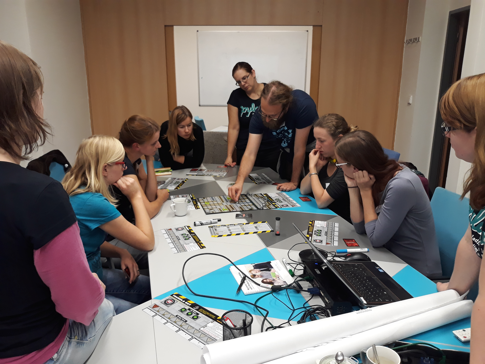

Title: První sraz
Date: 2018-10-10 09:58:00
Modified: 2018-10-10 09:58:00
Author: Anežka Müller

Letošní podzimní semestr se pro brněnské PyLadies nese částečně v duchu experimentů.
Krom klasického kurzu pro začátečníky se totiž pod vedením Petra Viktorina rozběhl nový formát tohoto kurzu a také novinka pro pokročilejší, kurz zaměřený na realizaci praktického projektu a týmovou spolupráci. 

V rámci kurzu budeme pod Petrovým dohledem v devítičlenné skupině převádět do počítačové podoby deskovou hru RoboRally.
Včetně dokumentace, testování, všeho potřebného.
Kurz nemá předpřipravené materiály, vše bude na nás.
Jak Petr krásně na úvod řekl, budeme se učit dělat software tak, jak by se dělal, kdyby na to byl dostatek času :).
Protože mi přesně něco takového, jako je praktický projekt, po absolvování začátečnického kurzu chybělo, rozhodla jsem se to zkusit.

Jak jsem již zmínila, kurz nemá žádné materiály, padlo tedy rozhodnutí psát o jeho průběhu blog. 

Složení našeho pracovního týmu je čistě dámské a všechny z nás jsou již s PyLadies nějak spojeny, ať už jako absolventky kurzů, nebo organizátorky. Sešly jsme se poprvé tento týden v prostorách společnosti Kinali, která se stala sponzorem tohoto kurzu a nabídla nám svoje prostory. Vděčíme za to Karolině, organizátorce začátečnického kurzu a zároveň účastnici tohoto projektu, která pro Kinali pracuje jako testerka. Děkujeme :) 

První setkání bylo primárně seznamovací. A to jak v rámci týmu, tak s náplní samotného kurzu (nebo spíše projektu) a toho, co nás čeká.
Proběhlo představovací kolečko, kde jsme mluvily také o tom, co nás do kurzu přivedlo. 
Většina z nás do toho jde s podobnou motivací - zdokonalit se v tom, co známe ze začátečnických kurzů, naučit se to více prakticky využívat, spolupracovat na vývoji, mít nějaký projekt, který budeme moci prezentovat.
A to nejen my, jednotlivé členky týmu, ale také celkově PyLadies, když se například účastníme nějaké konference nebo prezentace - budeme moci ukázat nějaký reálný výsledek práce absolventek kurzu. 

Po vzájemném představení přišla už praktičtější část setkání, vyzkoušely jsme si nakreslit mind mapu na příkladu šachů, abychom ji pak doma vytvořily pro RoboRally.
Poté přišla na řadu samotná hra. Patřila jsem k té části týmu, co ji nikdy předtím nehrála, takže to bylo rozhodně potřeba :)
Stihly jsme několik kol, abychom si trochu prošly pravidla a ukázaly, jak hra funguje.
Z časových důvodů se nám však hru nepodařilo dohrát.
Jako základ pro tvorbu myšlenkové mapy to ale určitě spolu s psanými pravidly postačí.

Příště se tedy sejdeme nad našimi mapami a uvidíme, co bude dál.
V mezičase nám pro domluvu a týmovou komunikaci bude sloužit Slack. 

