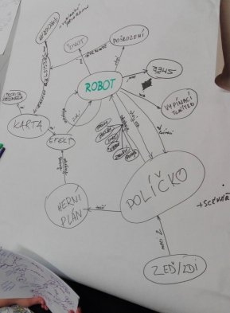

Title: Druhý sraz, aneb pořád kreslíme
Date: 2018-10-13 16:13:00
Modified: 2018-10-13 16:13:00
Author: Karolina Surma

 Kdyby se někdo zeptal, jak jedním slovem shrnu druhý sraz RoboProjektu, odpovím: "přituhuje".

Za podzimního večera jsme se opět v hojném počtu sešly (žádná to po prvním srazu nevzdala, hurááá!), tentokrát nad našimi mapami. I když jsem si myslela, že si naše výsledky budou podobné, opak byl pravdou. Na některých ze základních pojmů jsme se shodly, ostatní jsme zpracovaly každá úplně jinak.

Prvním úkolem srazu bylo tedy vytvořit společnou mind mapu naší hry. Rozhodly jsme se, že začneme "pohybem", tedy tím, co se děje na již existujícím herním plánu. Výběr plánu, robotího programu a akce před zahájením daného kola jsme prozatím z uvažování vynechaly. Centrální postavou naší mapy se stal robot, doprovázen neméně důležitým herním políčkem. Postupně jsme dokreslovaly další objekty a souvislosti mezi nimi. Zhruba po hodině jsme se shodly na finální podobě mapy. Než jsme otevřely šampaňské, Petr nás přivolal zpátky na zem s tím, že teď naše dílo můžeme zahodit.

 Naštěstí ne úplně. Python je objektový jazyk, takže naše "lidská" mapa se musí postupně převést na pojmy jemu známé. Další díl projektové skladačky vyžadoval vytvoření [UML diagramu](https://en.wikipedia.org/wiki/Unified_Modeling_Language). Na základě poznatků, získaných díky mapě, jsme se pustily do modelování tříd budoucího kódu. S každou odpovědí na otázku, co robot *má*, a co *umí*, se rýsovaly výraznější rozdíly mezi atributy a metodami. Pro každý atribut se následně definoval jeho datový typ, a pro každou metodu argumenty, které vezme, spolu s výsledkem, který vrátí. Nejsme ještě u konce: v rámci domácího úkolu se pokusíme diagramy dokončit a popřemýšlet mj., jak naprogramovat políčkům zdi.

Uff, a to jsme ještě nezaply počítače! Pro většinu z nás, ne-li všechny, je to první kontakt s tímto stylem uvažování o složitém a vcelku velkém problému.

 Pro odlehčení jsme chvilku debatovaly nad podobou, jakou dáme projektovému blogu. Na Petrovo doporučení jsme se rozhodly pro GitHub, kam posíláme příspěvky pomocí gitu. Myšlenka na git v nás sice zpočátku nevzbudila velké nadšení, ale všechny víme, že praxí se člověk učí nejlépe.
 
Petr nám zdejší stránky vytvořil a připravil pracovní prostředí, za což mu zde jménem účastnic chci poděkovat :).

