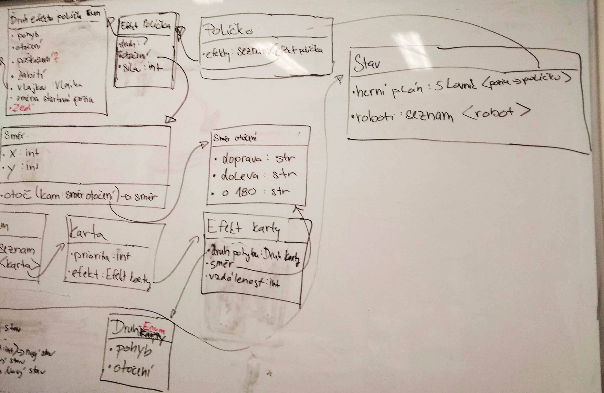

Title: Třetí sraz - pokračujeme s UML a začínáme s grafikou
Date: 2018-10-24 08:39:00
Modified: 2018-10-24 08:39:00
Author: Helena Olbertová


V první části dvouhodinovky jsme se věnovaly aktivní týmové spolupráci při rozebírání [diagramu tříd](https://en.wikipedia.org/wiki/Class_diagram) pro pohyb robotů, který máme rozdělaný už od minula. Poslední verzi nám Petr zase trošku zkorigoval a dál budeme na diagramu pracovat doma a příště. Aktuální diagram najdete tady:



  

V druhé části dvouhodinovky přišla na řadu tvorba grafiky. Zatímco vymýšlíme, jak se budou naše herní figurky hýbat, musíme jim také připravit herní podklad. K tomuto účelu používáme pro tvorbu vektorové grafiky [Inkscape](https://inkscape.org/) a pro skládání dlaždic do mapy [Tiled](https://www.mapeditor.org/) (ideálně verzi 1.2 a novější).

  

**Inkscape** jsme si nastavily všechny stejně.
Soubor → Nastavení dokumentu (nebo Ctrl + Shift + D) → Zobrazovací jednotky a Jednotky plátna nastaveno na px → velikost 64px x 64px.

V tom stejném nastavení přidáme mřížku - třetí záložka Grids → nová čtvercová mřížka → Počátek X = 0, Počátek Y = 0, Mezery X = 1, Mezery Y = 1, Hlavní čára mřížky každých: 8

Prvně zkoušíme, jak se v Inkscape kreslí tužkou a vyplňuje obvod a obsah. Potom každá Pylady dostala za úkol nějaký typ dlaždice, celkově jsme zatím připravily tyhle typy dlaždic: 
wall, flag, starting square, laser, laser base, pusher, repair, hole, ground, conveyor belt 1, conveyor belt 2.

Všechny ukládáme ve vektorovém formátu SVG a navzájem si je sdílíme na Slacku, takže všechny máme k dispozici stejnou sadu dlaždic, kterou si ukládáme do složky Tiles. Nejsou to ještě konečné verze grafiky, ale už nám pomůžou orientačně rozložit mapu. Později budeme mít možnost je snadno nahradit nějakými více vychytanými s jednotnějším vzhledem.

Alternativně, protože na některých operačních systémech takto uložené soubory zlobí (vykreslují se v Tiled se špatnou velikostí), se mohou obrázky z Inkscape vyexportovat do PNG. V menu Soubor najdeme Export PNG Image a na zobrazené boční liště vybereme tlačítka Page a Export. Takto vyexportované soubory se jednoduše naimportují do Tiled dle návodu níže.

  
A teď hurá na druhý prográmek – **Tiled**. 
Dáme si Soubor → New → New Map (Ctrl + N), kde nastavíme 
Orientace: ortogonální, 
Formát vrstvy dlaždic: CSV, 
Pořadí vykreslování dlaždic: Doprava a dolů, 
Velikost mapy – Fixed 12 x 12 dlaždic, 
Velikost dlaždice: 64 px x 64 px. 
Projekt uložíme s libovolným názvem a koncovkou [JSON](https://naucse.python.cz/course/pyladies/intro/json/).

Pokračujeme s importem našich dlaždic. 
Vpravo dole najdeme oddíl Sada dlaždic a stisknutím New Tileset pokračujeme na výběr názvu sady – dáváme „Robots“ a možnost Ze sady obrázků. 
Vpravo dole pod oddílem dlaždic klikáme na malinkou ikonu s klíčem, na popisku stojí Edit Tileset. To nám otevírá novou záložku, kde v horní liště klikneme na ikonku + s popiskem Přidání dlaždic. Najdeme adresu naší složky Tiles a označíme všechny obrázky dlaždic. 
Vracíme se do záložky s mapou a můžeme si trošku pohrát s naší první herní mapou. Z vektorové grafiky jsme získaly obrázky s průhledným pozadím a tak je můžeme pěkně vrstvit. Do spodní vrstvy se můžou dát třeba země, jáma, … Do další vrstvy další dlaždice typu zeď, posuvné pásy, lasery a podobně. 
Jednotlivé objekty je možné i libovolně otáčet. 
Náš výtvor můžeme nechat přes Soubor → Exportovat jako a nastavíme si typ JSON.

Další část lekce jsme věnovaly průzkumu mapového souboru JSON v textovém editoru.

Každý typ dlaždice má svoje ID – první má číslo 0 a je to abecedně název první dlaždice, další následují. V seznamu políček ale vidíme čísla typů dlaždic od 1, takže abecedně první typ dlaždice je v Tiled ID: 0 → v seznamu vidíme ID: 1.

Teď se můžeme podívat do organizace vrstev – v Layers máme tentokrát jenom jednu vrstvu. Každé políčko mapy má svoje souřadnice – čísla běží jako seznam z levého horního rohu mapy doprava a pak následuje další řádek.

Pokud máme komplikovanější mapu s více vrstvami a také otočenými dlaždicemi, můžeme v layers vidět více seznamů a v některých budou i veliká čísla, jako například 1610612738. To je číslo šestnáctkové soustavy. Rozluštit nám ho pomůže třeba Python přes příkaz hex(číslo).  
  

Máme pro první řádek mapy například políčka:

nic – dlaždice ID:1 (conveyor belt 2) – nic – ID 1 otočené doprava – nic - ID 1 otočené dolů – nic – ID 1 otočené doleva – nic - nic – nic- nic

Zápis vypadá takto

"data":[0, 2, 0, 2684354562, 0, 3221225474, 0, 1610612738, 0, 0, 0, 0 … a následují další řádky

zadáme do Pythonu:

```python
>>>cislo = 2684354562
>>>hex(cislo)
'0xa0000002'
>>>cislo & 0xFFFFFFF # kouzelná formulka pro zjištění ID dlaždice
2
>>>cislo>>(4*7) # kouzelná formulka pro zjištění otočení
10
```

S dalšími čísly dostáváme 12 a 6.

Takže otočení doprava v tomto případě je hodnota 10, dolů 12 a doleva 6.

 

A to bylo tentokrát vše.

Příští lekce se bude věnovat GITu s Jirkou, máme si zopakovat lekce [Správa zdrojového kódu](https://naucse.python.cz/course/pyladies/sessions/git/) a [Spolupráce a Open-Source](https://naucse.python.cz/course/pyladies/sessions/foss/).

Za dva týdny bude následovat další lekce s Petrem, na kterou máme za úkol náš mapový podklad, prozatím s jednou vrstvou a bez otáčení prvků, uložit ve formátu JSON, naimportovat do Pythonu a mapu vykreslit v Pygletu.

A jak na to? Chceme načíst herní plán jako slovník políček.

  

STAV = slovník políček
klíč: (x, y)
hodnota: seznam efektů # ← číslo z JSON

  

Nahrávaná mapa má pouze 1 vrstvu, bez otáčení dlaždic.
