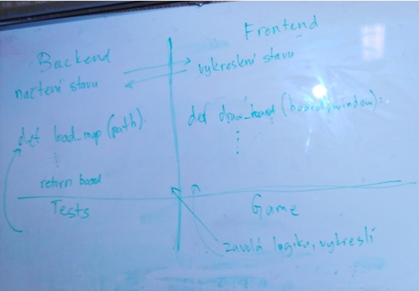
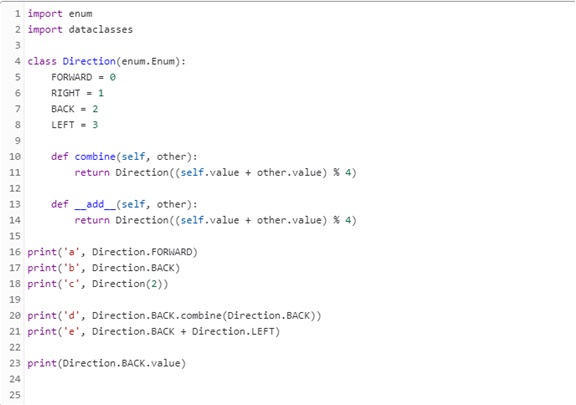

Title: Pátý sraz 
Date: 2018-10-30 18:00:00
Modified: 2018-11-06 09:58:00
Author: Iveta Česalová

Z předminulé hodiny s Petrem jsme měly za úkol vytvořit slovník políček (STAV = slovník políček klíč: (x, y) hodnota: seznam efektů) a vykreslit v Pygletu mapu s jednou vrstvou bez otáčení prvků. Jelikož spousta z nás s tím měla problémy, probrali jsme na začátku srazu krok po kroku jak na to.
Na githubu byly nahrané dvě verze kódu, od Terky a Karoliny, které úkol zvládly. Zvolili jsme ponechat [Karolinin kód](https://github.com/PyLadiesCZ/roboprojekt/blob/35a98aa967386d82a4dbca23a0ade65cc8b96767/karolina_state.py).
Postupně jsme procházely, co je v kódu a Petr zmínil, co je třeba opravit (sjednotit terminologii, pojmenování proměnných, správně přeložit do angličtiny, stejně jako komentáře…)

 
A nastala otázka - Co dál? Jak si rozdělíme úkoly?

*       Načíst mapu s více vrstvami
*       Načíst mapu s otočenými políčky
*       Napsat testy
*       Celý dosavadní kód rozdělit na jednotlivé funkce
*       Popisek základního repozitáře v Githubu

 
Důležitou věcí, jak pokračovat v našem projektu je jeho rozdělení na 4 moduly:
**Backend** – načte mapu, tedy náš slovník Stav, **Frontend** – vykreslí mapu, **Game** – spustí hru, **Testy** – vyzkouší, jestli funguje, co je v backendu.
Až budou tyto moduly hotové, smažeme původní script  kde je celý kód.

V další části jsme se naučily něco nového, využití knihoven **enum** a **dataclasses**. Kdo neměl nainstalované, použil v příkazovém řádku následující příkazy:
`python -m pip install dataclasses`
`python -m pip install enum`
 
Tyto knihovny nám umožní jednodušeji psát výčtové typy a datové třídy. Kdo nezná třídy, zopakuje si (https://naucse.python.cz/course/pyladies/sessions/class/)
 
Poté jsme v editoru vytvořily nový soubor – demo.py kde máme třídu Direction, která dědí z výčtového typu enum.Enum. Definovaly jsme si funkci, která vyhodnotí směr (nejdřív se sečtou hodnoty a zbytek po dělení 4 => získáme směr).

Dále následovalo vysvětlování modulu **dataclasses**. Tento modul poskytuje dekorátor a funkce pro automatické přidávání generovaných speciálních metod, jako jsou __init __ () a __repr __ () do uživatelsky definovaných tříd. 
Vytvořily jsme si soubor demo_dataclasses.py, kde máme třídu datového typu. Karta má jednotlivé vlastnosti (prioritu, efekt) určitého typu.
Více informací o dataclasses zde: (https://docs.python.org/3/library/dataclasses.html)
Nevím, jak to pochopily ostatní, ale asi nám to Petr ještě dovysvětlí, k čemu to přesně slouží :-)

Do příště máme každá svůj úkol, rozdělení máme na githubu v záložce Issues.
