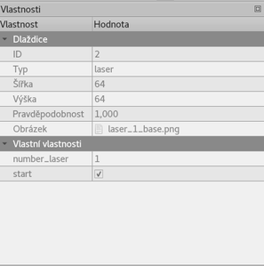

Title: Osmý sraz - Málo úkolů?
Date: 2018-11-20 18:00:00
Modified: 2018-11-20 18:00:00
Author: Terezie Vahalová

Sraz začal tématem **Máme málo úkolů**. Takže se Petr trochu rozjel a začal psát jeden Issue za druhým.

Problém je, že některé úkoly můžeme začít dělat, až po dodělání jiných. Na to nám v GitHubu založil štítek **blocked**.
 
Veškerý další vývoj teď stojí na úkolu **Předělat strukturu dat.**

Aktuálně máme mapu vyřešenou ve slovnících po vrstvách. Ke každé souřadnici ve vrstvě mapy je přiděleno jedno políčko a to včetně prázdných políček. Vhodnější je ale zápis obrátit. Pro každou souřadnici vytvořit seznam všech políček, co na ni jsou a nepřidávat do seznamu prázdná políčka `board = {(x,y):[Tile, Tile, Tile],… }`. Po předělání struktury dat, se nám bude lépe určovat efekt políčka a nemusíme kvůli zjišťování všech efektů políčka procházet všechny vrstvy mapy.
  
**Dopsat `__repr__` do tříd**

Aktuálně se nám printované výstupy z funkcí zobrazují ve velice nehezkém formátu

`{(0, 11): [<backend.Tile object at 0x7f10c49297f0>],… }`
  
Aby byla práce příjemnější, je potřeba použít metodu `__repr__`, která nám převede výstupy z tříd do lidsky čitelného formátu.  
  
Např. úprava:
```python
class Tile:  
...  
def __repr__(self):  
    return '<Tile {} {}>'.fomat(self.rotation, self. path)
```
  

zformátuje původní slovník na: `{(0, 11): [<Tile 0 ./img/squares/png/ground.png>]`
   
**Efekty políček přidat do mapy jako "properties"**

V Tiled je potřeba u každého obrázku, který mapa používá, nastavit typ políčka. Tato informace se nám pak přenese do jsonu a můžeme s ní dál pracovat.  
Typ políčka nastavíme jako “ground”, “hole”,… u některých je potřeba ještě typ doplnit o další vlastnosti (Custom Properties) jako třeba u pásů, o kolik se posunou => int, u laserů počet a bool varianta pro start laserů, u otáčecího políčka směr…



**Validace mapy**

U mapy potřebujeme zkontrolovat, že jsou všechny prvky správně umístěny nad sebou. Na mapě nemusí být vidět vše. Destrukční políčky by mohla být omylem schována pod jiná a efekt by se provel i když by nebyl na mapě “vidět”. Validační program/test potvrdí, že díry, lasery a ostatní efektní políčka jsou ve správném pořadí a budou na mapě vidět.

V případě, že mapa správně nebude, program vyhodí chybu ideálně i se souřadnicí, kde je potřeba udělat opravu.


**Udělat pohyb robota – metodu "Robot.posuň se" z diagramu**

Úkolem je vymyslet metodu třídy Robot, která posune robota dopředu.
Metoda by měla brát stav a vzdálenost a vytvořit nový stav. 

**Automaticky exportovat PNG obrázky** 

Úkolem je udělat program, který při spuštění vygeneruje z svg obázků všechny png obrázky, které ještě nemáme. Tím si ulehčíme práci při přidávání dalších obrázků.

Vzorový program pro jeden obrázek vypadá takto:
```python
    import sys
    import subprocess  
    ​
    subprocess.run(
        ['inkscape', 'img/robots_map/svg/MintBot.svg',
         '--export-png=ex.png', '--export-area-page'],
        check=True,
    )
```

V příkazové řádce pak spustíme program:

 

    $inkscape svg/MintBot.svg --export-png=ex.png --export-area-page


Úkolů máme pro příští týden hodně a navíc ještě máme každá vymyslet a nakreslit grafické rozhraní pro hru.
