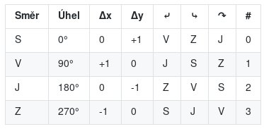
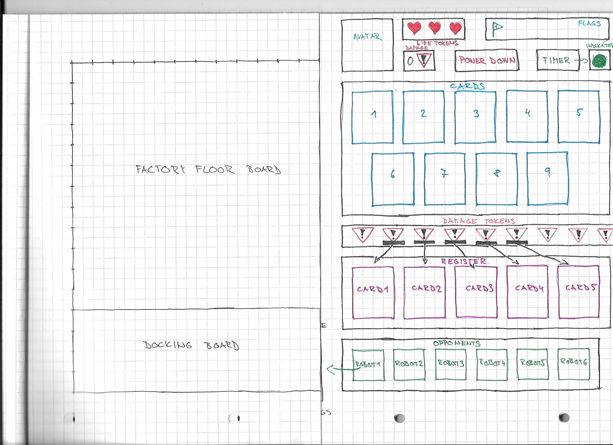
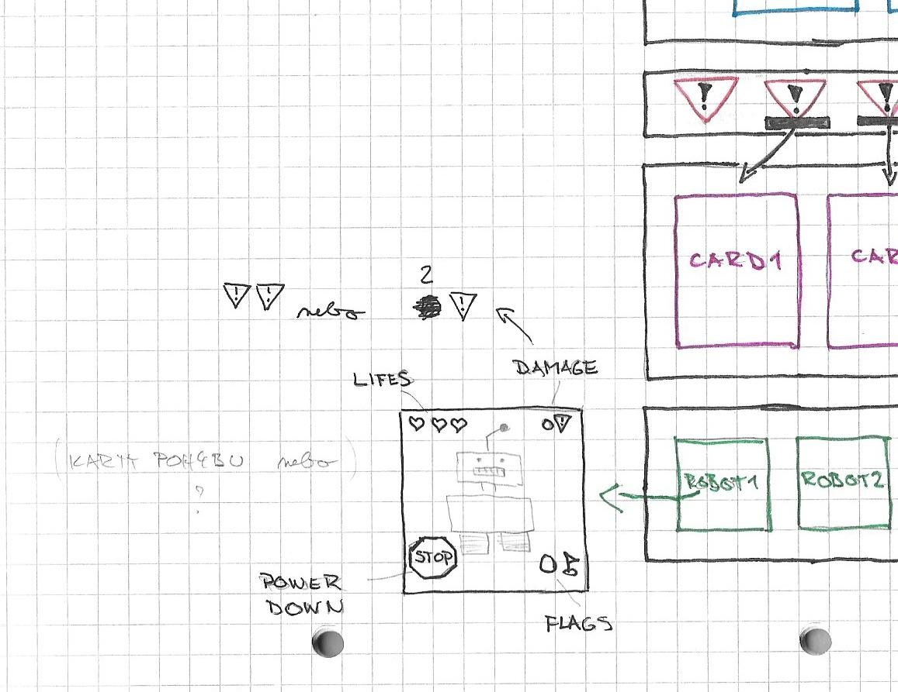

Title: Devátý sraz - Upravujeme a navrhujeme
Date: 2018-11-27 18:00:00
Modified: 2018-11-27 18:00:00
Author: Anežka Müller

Na začátku srazu jsme dokončovaly řešení dlouhotrvajícího problému, jak na políčka, která umí ve hře hromadu věcí. Mimo jiné políčka mohou mít zdi, které neblokují jen robota v pohybu, ale zejména nás docela blokovaly v dalším vývoji, protože jsme nevěděly, jak na ně. Řešení padlo na [minulém srazu](https://roboprojekt.pyladies.cz/osmy-sraz-malo-ukolu), tedy vyřešit efekty políčka tím, že každé políčko bude mít typ a vlastnosti definované přímo v popisu při tvorbě mapy a budou pak součástí výstupu v JSON. Odtud se budou dát načíst pro použití ve hře, potřebná data pak bude obsahovat třída `Tile`, kterou je o ně třeba rozšířit. Tím se pak mohou řešit i zdi, tedy třída `Tile` může obsahovat metodu ověřující, zda se lze pohnout z daného políčka nebo na dané políčko. Až to bude fungovat, můžeme se pustit do dalších efektů.

Poté jsme se posunuly k úpravám stávajícího kódu. První věc jsme si ukazovaly na příkladu načítání vstupu. Obecně je dobré psát programy tak, aby byly tak univerzálnější. V současnou chvíli naše hra pracuje pouze s formátem dat v JSON. Z JSON získáváme slovník `data` obsahující hromadu informací, které pak dál zpracováváme v různých funkcích, a také z něj získáváme konkrétnější informace. Pokud bychom chtěly pracovat s jiným vstupem, bude obtížnější tuto část kódu měnit, protože má více výstupů. **Je dobré stavět program z částí, které je možné jednoduše vyměnit.** V našem případě by tedy bylo ideální mít funkci, která dostane jako vstup jméno souboru a vrátí stav hry. Vše, co potřebujeme používat v kódu dál, by měl stav hry obsahovat. Cílem je stavět program z celků, které jsou na sobě více nezávislé. Stavebních bloků, které mají jeden vstup a jeden výstup. Toto budeme v naší hře aplikovat tím, že, oddělíme část, která načítá data, do samostatného modulu, nebude tedy součástí backendu, a také budeme psát komplexnější funkce. Abychom si zajistily, že používáme minimální rozhraní, jen to, co je skutečně nutné, bylo by dobré importovat přímo funkce, ne celé moduly. 
Důležité je také vyhnout se cyklickým importům. To se nám stalo při načítání konstant. Řešením pro tento případ může být vytvoření separátního modulu s konstantami, abychom se vyhnuly problému, ve kterém ze stávajících modulů je mít, aby vše fungovalo bez problémů. Není také zpravidla dobré importovat v rámci funkce, většinou bývají lepší možnosti. 

V rámci úprav a oprav byla také zmíněna **reprezentace směru**. Nyní máme v kódu směr reprezentovaný stupni a čísly. Když je zkombinujeme se směry otočení (doleva, doprava, o 180°), veškerý pohyb, který pro hru potřebujeme, reprezentuje je tato tabulka:



V backendu se objevil následující if:
```
if direction == 0:
    y += distance
elif direction == 90:
    x += distance
elif direction == 180:
    y -= distance
elif direction == 270:
    x -= distance
```
Lepší provedení by bylo pomocí třídy otočení, která by uměla věci znázorněné v tabulce. Je třeba se rozmyslet, co bude lepší jako atribut a co jako metoda. Vytvoření této třídy je jeden z úkolů do příště. 

Po úpravách a vylepšeních jsme se dostaly k dalšímu vývoji. Úkolem z minulého setkání bylo navrhnout pro naši hru **rozhraní**. Sešlo se několik nápadů, nejpropracovanější návrh přinesla Katka:




Petr přišel s návrhem, že by bylo dobré mít dvě nezávislá okénka, jedno čistě na zobrazení mapy a druhé s interaktivní částí, kde se hra ovládá. Má to několik výhod, ať už při prezentaci projektu, nebo jeho tvorbě - separátně se to bude lépe kreslit a také udržovat oddělené. Vykreslení mapy už máme, v tuto chvíli je tedy potřeba zkusit napsat program, který vykreslí (zatím statickou) verzi interaktivního rozhraní. Jako pracovní postup Petr navrhoval nakreslit si novou část v Inkscape pro představu, jak celá věc bude vypadat na obrazovce, a až pak začít kódovat.

V rámci rozhraní jsme také řešily, jakým způsobem se budou vybírat karty. Možností je více, přetažení myší, výběr pořadí karty stiskem čísla na klávesnici, kdy se pak karta automaticky posune na první volné místo v registru, nebo kliknutí nejprve na kartu a poté na požadovanou pozici.

Součástí hry by mohl být i výběr robota, kde by se ke každému krom jeho obrázku ukazoval i krátký text, příběh daného robota. Padaly i nápady do budoucna, například práce se skrýváním karet nebo speciální vlastnosti robotů, to ale pro tuto chvíli řešit nebudeme :)

Na závěr jsme se bavily také o **licenci**, kterou by náš projekt měl mít. Jako autorky projektu si ji můžeme samy zvolit. Musíme se tedy rozhodnout, jak chceme, aby náš projekt lidi používali a co s ním budou moci dělat. Budeme se rozhodovat mezi dvěma druhy open source licencí, které se liší podle toho, pod jakou licencí může daný projekt kdokoliv další rozšiřovat. Na tomto se tedy musíme také v dohledné době dohodnout.
