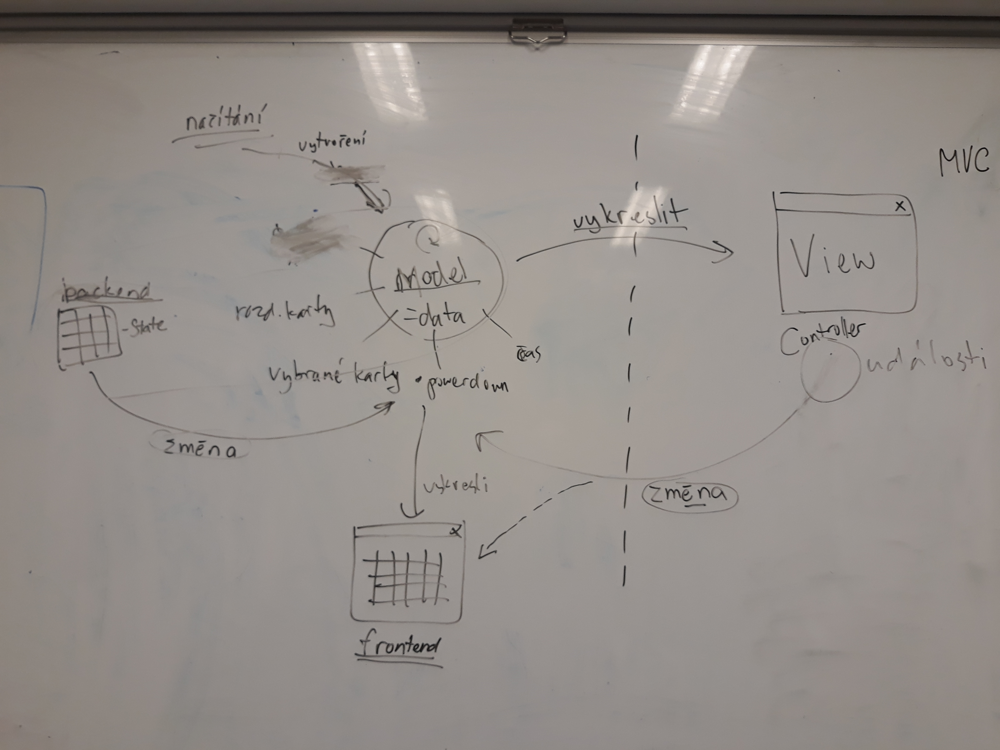
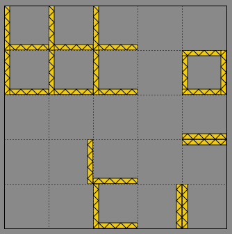

Title: Jedenáctý sraz - MVC a spousta práce
Date: 2018-12-11 18:00:00
Modified: 2018-12-11 18:00:00
Author: Anežka Müller

Vzhledem k tomu, že aktuální stav projektu sám generuje další a další úkoly a problémy k řešení, stejně jako schůzka minulá, i toto setkání se na začátku neslo v duchu řešení toho, na co jsme narazily při práci v uplynulém týdnu.

Úspěchem od minulé lekce je, že se roboti zastavují o zdi, pracujeme na rozdělení backendu na více modulů, snažíme se o aktualizaci glosáře pojmů, který nám bude užitečný při práci s kódem, pojmenovávání funkcí a tvorbě dokumentačních řetězců, aby názvosloví bylo jednotné, a přibyl také validátor map. 

Protože bychom měly rády v projektu většinu věcí automatizovanou, jedním z úkolů byl i automatický převod obrázků z vektorového SVG do PNG. Objevil se ale problém se spouštěním Inkscape z příkazové řádky. V Linuxu to funguje jednoduše - když člověk napíše do terminálu Inkscape, program se spustí. To bohužel není přenositelné do Windows. Nezbývá tedy, než vypsat všechny možné cesty, které může Win použít, aby kód fungoval i s tímto OS. 
Také bychom chtěly, aby se pak vygenerované soubory PNG ukládaly do jiného adresáře, je tedy třeba ve funkci pro převod nejen nastavit novou příponu souboru, ale i novou složku.
Užitečným pomocníkem zde je knihovna [pathlib](https://docs.python.org/3/library/pathlib.html), která umí například jednoduše měnit příponu, rozkouskovat cestu, zaměnit její části a tím pádem vytvořit cestu novou. Umí také vytvořit adresáře dané cesty a [další šikovné věci](https://github.com/pyvec/cheatsheets/blob/master/pathlib/pathlib-cs.pdf).

**Hvězdičková magie**

Při vytváření funkce na automatické generování souborů PNG jsme narazily na to, že potřebujeme jako argument funkce použít postupně všechny prvky seznamu, o kterém nevíme, kolik těch prvků celkově má. Pro tento případ lze použít hvězdičku. Hvězdička pak jednotlivé prvky seznamu naskládá jako argumenty dané funkce. 
```python
def add(a, b, c, d, e, f):
    return a + b + c + d + e + f

arguments = [2, 3, 4, 5, 6, 7]

result = add(*arguments)
print(result)
```

Hvězdička lze využít například i při tvorbě seznamu, princip je stejný, postupně použije jednotlivé prvky. Tedy `print([1, *arguments, 8, 9])` vypíše `[1, 2, 3, 4, 5, 6, 7, 8]`, zatímco bez hvězdičky by se vložil celý seznam arguments jako prvek nového seznamu, tedy `[1, [2, 3, 4, 5, 6, 7], 8]`.
Hvězdička takto funguje na vše, co se dá rozložit na jednotlivé prvky, tedy i na řetězce. Hvězdička tedy označuje nějakou sekvenci a používá jednotlivé prvky dané sekvence. 

**Stav hry**

V současné chvíli je kód napsaný tak, že vytváří stav hry, který obsahuje herní plán (rozmístění jednotlivých políček), jeho velikost a také všechny roboty. Myšlenka je taková, že se při jakékoliv změně vytvoří nový stav hry. Tento přístup jsme zvolily na jednom z prvních setkání. V současnou chvíli ale stav hry vrací pouze funkce pro vytvoření stavu počátečního, vše ostatní s ním jen dále pracuje a upravuje ho, ale nevrací stav nový. Do budoucna bude třeba tuto problematiku řešit, až budeme chtít posílat stav hry na jiný počítač pro variantu multiplayeru, v současné fázi vývoje to však ještě není třeba. Je to ale něco, na co dříve či později narazíme.

**Rozhraní pro ovládání hry**

Na minulém srazu jsme se dohodly, že rozhraní pro ovládání hry bude vykresleno v samostatném okně. Do tohoto úkolu se pustila Terka. Pro ovládání hry zvolila klávesy. To ovšem generuje problém, jak sdělit programu, která klávesa je zmáčknutá. Existují dvě varianty. Lze vuyžít nadefinování uživatelem, kdy by si hráč sám určil, které klávesy chce pro ovládání používat, nebo varianty, kdy systém říká, jaký uživatel zadal text, nikoliv jakou zmáčkl klávesu. Tento přístup však neumožňuje pracovat s tím, když uživatel klávesu pustí, zpracovává jen vstup v podobě řetězce, který by se objevil v textovém editoru.

*Jak navrhovat rozhraní*

Při návrhu uživatelského rozhraní se osvědčil tzv. MVC návrhový vzor, zkratka pro **“Model - View - Controller”**.
Model v našem případě reprezentuje data. Jaké karty má hráč, kolik má který robot životů, kolik už nasbíral vlajek apod. Toto rozhraní pak dokážu vykreslit, což bude naše View. Operace “Vykreslit” vezme model a vykreslí ho do okénka. 
Když uživatel udělá nějakou změnu, udělá se na modelu a vykreslí se nový stav. Většinou se volí přístup, kdy vykreslování a reakce na události jsou od sebe oddělené, jsou to dvě různé funkce nebo i různé moduly. Reakce na události by tedy byl náš Controller, pokud bychom se držely MVC terminologie. 
Změny ve hře mohou pocházet i odjinud než z controlleru a view může zobrazovat různé věci. Obrázek níže tak ukazuje aplikaci MVC na náš současný kód, kdy View zobrazuje dvě různé věci, ovládání hry a herní plochu. Navíc máme stranou načítání, které umí vytvořit část modelu, konkrétně herní plán bez robotů. Ty potom dodá backend.



V současnou chvíli také pracujeme pouze s jedním stavem, který měníme, což bylo zmíněno výše. Ve chvíli, kdy budeme pracovat s tím, že se model bude synchronizovat mezi více počítači. Pak bude třeba, aby každá změna, která upravuje stav, zavolala funkci, která řekne, že se stav změnil a pošle novou verzi stavu. Je dobré mít změny oddělené a co nejmenší. 
Změny modelu lze řešit několika způsoby: úprava atributu/proměnné (jak to děláme teď), notifikace o změně, metoda modelu (nezáleží na tom, jak jsou data v modelu reprezentována, pracujeme pouze s tím, co se má stát) nebo vytvoření objektu, který reprezentuje změnu, což je dobré, pokud změna ovlivňuje více věcí, než model. Toto jsou věci, které budeme v budoucnu potřebovat nějak vyřešit. 

**Políčka**

Často se vracíme k problematice zdí a narazily jsme na ni i na této lekci. Tentokrát se jednalo o vzhled mapy. Zeď se nyní dá na políčko dát kamkoliv a v některém případě, kde na sebe zdi navazují, to může generovat nehezké vyobrazení (viz obrázek). 



Petr přišel s návrhem, kdy by nejen u zdi, ale i u laseru pomohlo, kdyby v budoucnu bylo odděleno to, jak mapa vypadá v editoru a jak bude poté vypadat ve hře. Například u laserů, kde hraje zásadní roli, kterým směrem laser střílí, by v editoru mohly být šipky, aby bylo vidět, že je laser správně otočený. Ve hře už by to viditelné nebylo. Stejně tak by to mohlo fungovat u zdí. Při tvorbě mapy by bylo jasné, součástí kterého je políčka, ale nerovnosti jako na obrázku výše už by nebyly vyobrazené v samotné hře. Například lze udělat obrázek posunutý o několik pixelů, takže bude vypadat, jako by zeď byla skutečně na hranici mezi dvěma políčky. Opět něco, co nás čeká v budoucnu. 

**Dědičnost**

Jako jeden z dalších úkolů je rozpracovat efekty políček. Pro naši hru bude dobré zopakovat si dědičnost mezi třídami a vytvořit jednotlivá políčka jako podtřídy naší třídy `Tile`, ze které budou dědit. Třída Tile tak bude obsahovat všechny metody, které mohou v jejích podtřídách nastat, ale bez vracení konkrétního efektu. Konkrétně pak metoda bude rozepsána až v dané podtřídě. Bohužel jsme dědičnost proletěly jen z rychlíku, tak bude tento úkol do příště poměrně náročný :) 

Spolu s ním nás čeká ještě dokončit rozdělení kódu na moduly, další práce s roboty a také s rozhraním hry, potřebujeme také zařídit, aby se dala měnit velikost vykreslených oken a zároveň se tomu přizpůsoboval jejich obsah a stále máme několik dlouhodobých úkolů. Práce tedy není málo :) 
