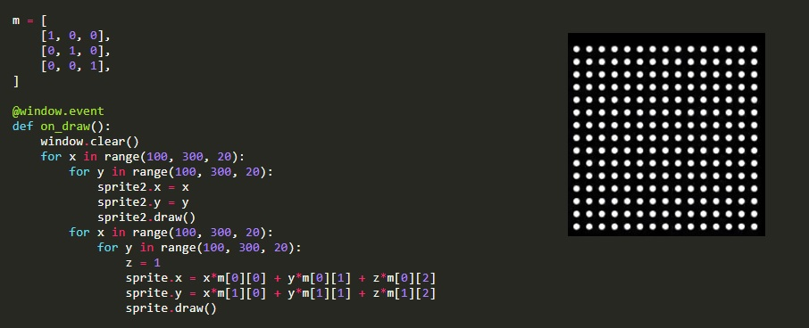
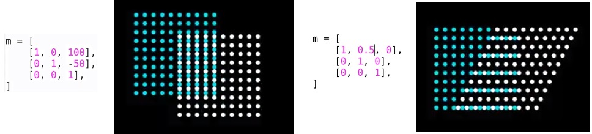
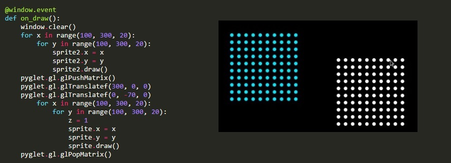
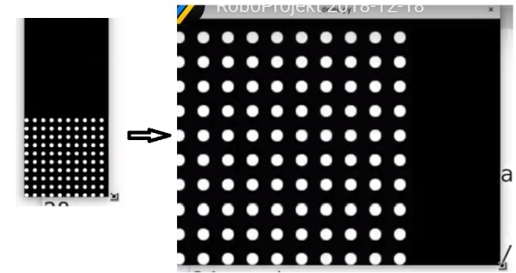

Title: Dvanáctý sraz - matice
Date: 2018-12-18 18:00:00
Modified: 2018-12-18 18:00:00
Author: Iveta Česalová

<div class="text-justify">Po počátečním zmatku, kdy si Petr zapomněl svůj počítač, jsme poslední sraz roku zahájily opět rekapitulací, co kdo dělal. Doposud byla hra rozdělena na čtyři moduly – backend, frontend, game a testy. Nyní je v backendu pouze třída Robot, State a funkce pro načtení souřadnic, cesty k robotům, počtu políček a počáteční stav hry.</div>

<div class="text-justify">V repozitáři přibylo několik souborů. Loading.py obsahuje funkce, které kompletně načtou mapu se všemi potřebnými komponenty a vlastnostmi a soubor Util.py zase třídy Tile a Direction. Soubor Validator.py kontroluje, zda je mapa správně vytvořena.</div>


####Kouzelné podtržítko####
<div class="text-justify">Pokud chceme, aby někdo ve zbytku kódu nepoužíval konkrétní proměnnou (slovník, seznam...), dáme před ni podtržítko, jako např u ` _board`. Značí věci, které jsou pro nějakou třídu interní a ten, kdo nemá dobrý důvod pracovat s vnitřnostmi určité třídy, měl by použít něco jiného. Podtržítkem říkám – vyhrazuji si právo cokoli změnit..</div>
```python
class State:
    def __init__(self, board, robots, sizes):
        self._board = board
        self.robots = robots
        self.sizes = sizes
```


####Nekombinovat více knihoven####

Není dobré v kódu kombinovat více knihoven, když lze použít jen jednu :-) Konkrétně v souboru export_img.py, který nám automaticky převádí soubory SVG do PNG formátu jsou použity knihovny *os* a *subprocess*, tvorba adresáře příkazem `os.mkdir()` lze nahradit `Path.mkdir()` a není potřeba importovat os.


####Matice####
<div class="text-justify">Velkým tématem srazu byly **MATICE**. Řešíme totiž problém ohledně změny velikosti obrazovky a aby se mapa správně měnila. Matice je schéma čísel či matematických objektů, používají se na transformaci grafiky.</div>

**Druhy transformace**: posun, zvětšení, rotace, zkosení, zrcadlení.

*Maticové násobení* – transformace se zkombinují.

<div class="text-justify">Máme obrázek o souřadnicích x, y a vynásobím je maticí, která reprezentuje posun či jinou transformaci. „z“ bude vždy 1.
Petr nám to vysvětloval na dvou čtvercích, skládajících se z koleček. Bílá kolečka jsou původní, modrá transformované pomocí matice. Matici můžu v kódu jednoduše měnit. </div> Jednoduchý návod k nalezení [zde](https://en.wikipedia.org/wiki/Transformation_matrix#/media/File:2D_affine_transformation_matrix.svg).

Původní matice a výpis bílých koleček:




**Transformace**




####Pyglet a knihovna OpenGL, aneb jak nastavit transformační matici pro celou scénu.####
<div class="text-justify">Pomocí funkce `pyglet.gl.glPushMatrix()` řeknu – zapamatuj si počáteční stav. Naopak na konci `pyglet.gl.glPopMatrix()` vrátí do původního stavu. Mezitím můžu upravovat transformační matici dle potřeby.

Mezi základnější funkce patří:

`pyglet.gl.glTranslatef()` – posun

`pyglet.gl.glRotate()` – rotace

`pyglet.gl.glScale()` - změna měřítka</div>



A jak vyřešit potřebnou změnu velikosti obrazovky? Pomocí `pyglet.gl.glScalef()`

``` python
@window.event
def on_draw():
    window.clear()
    pyglet.gl.glPushMatrix()
    zoom = min(
        window.height/200,
        window.width/200
    )
    pyglet.gl.glScalef(zoom, zoom, 1)

    for x in range(0, 200, 20):
        for y in range(0, 200, 20):
            z = 1
            sprite.x = x
            sprite.y = y
            sprite.draw()
```



<div class="text-justify">Na začátku kurzu jsme plánovaly jeho trvání do konce prosince, ovšem bylo to přehnaně optimistické. V dalším roce nás bude o něco méně a pravděpodobně se nebudeme scházet každý týden, takže nečekejte pravidelný blog :-) </div>
