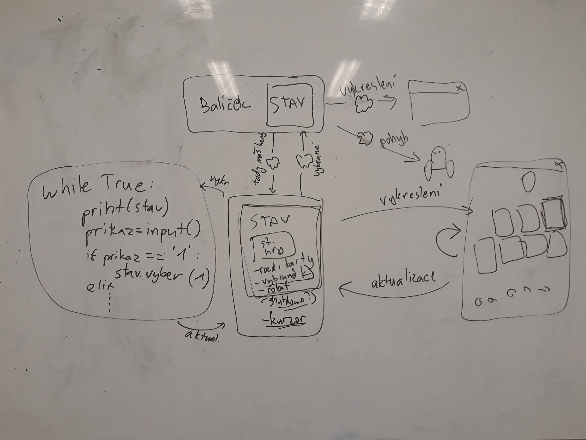

Title: Třináctý sraz - Co dál?
Date: 2019-1-8 18:00:00
Modified: 2019-1-8 18:00:00
Author: Anežka Müller

Od posledního srazu uplynula poměrně dlouhá doba, neviděly jsme se mezi svátky ani první lednový týden, protože setkání připadalo na 1.1.
Rekapitulace, co kdo dělal, ale nebyla nijak obsáhlá, vzhledem k tomu, že pauza zahrnovala hlavně vánoční svátky a Silvestra. Každá z nás pracovala na nějaké separátní části kódu, které se věnovala už předtím. Také je nás opět o něco méně, aktuální počet členek týmu je 5. 

**Co dál?**

Hlavní otázka setkání byla, do čeho se po svátcích pustit. Začly jsme tedy probírat postupně jednotlivé issues a aktuální pull requesty našeho projektu. Tím jsme si i shrnuly, v jakém je projekt stavu. Třeba u dokumentačních řetězců byla na začátku situace taková, že je nikdo nepsal, po založení issue došlo k jejich doplnění a nyní si na to již většinou dáváme pozor a píšeme dokumentační řetězce zároveň s kódem. 
Ačkoliv to na začátku vypadalo, že nevíme, co dál, z issues vyplynulo docela dost úkolů. Nemáme dokončené testy pro validaci mapy, což je poměrně komplexní úkol, ale nebrzdí nás v dalším vývoji. Velkým tématem je rozhraní hry. Důležité zde je, stejně jako u herního plánu, aby byl stav oddělen od toho, co se poté vykresluje do okénka. 



Stav je v tomto případě vykresleným okénkem modifikován - výběrem karet apod. Neměl by ale být závislý na konkrétním vykreslení, dobrou pomůckou může být program pro příkazovou řádku, například: 

```python
while True:
    print(stav)
    prikaz = input()
    if prikaz == "1":
        stav.vyber(1)
    elif...
```

Příkazová řádka v tomto případě dělá totéž co vykreslené okýnko, vypíše daný stav a na základě zadaného vstupu ho aktualizuje.
Je třeba se rozhodnout, které věci budou součástí stavu a které rozhraní. Část vstupů pak také přijde přímo od hry, například vybrané karty, se kterými bude robot pracovat. Součástí stavu tedy budou jen karty vybrané, celý balíček stojí mimo a nedostane se k jednotlivým hráčům. 

Dalším velkým úkolem, který nás blokuje v dalším postupu, je přidání efektů jednotlivým políčkům. Jde o hodně komplexní práci, kde jsme možná nepostupovaly nejlépe, když na něm pracovala jen jedna z nás. U takto velkých částí kódu je lepší rozdělit je na menší úkoly a začleňovat postupně. Aktuálně se jedná o obrovský pull request, který mění většinu modulů, což není ideální stav. Další práci na efektech políček tedy musíme rozdělit mezi více lidí, aby byla práce efektivnější. Abychom se posunuly dál, potřebujeme zařídit, aby lasery střílely, pohybovaly se pásy apod. 
Z diskuse nad tímto rozpracovaným kódem vzešel zajímavý nápad, jak vyřešit, když robot během herního kola umře a měl by se na začátku kola dalšího vrátit na startovní políčko. Zůstal by mu atribut `death`, který by označoval stav, kdy robot není na mapě, ale není ještě definitivně vyřazen ze hry. Další možností je pak odstranit robota z herní plochy změnou souřadnic, což by lépe řešilo další efekty, které ve hře probíhají a robota, který je aktuálně vyřazen, by se neměly týkat. 

Dalším bodem ve hře je zařídit, aby roboti posouvali nejen sebe, ale i ostatní roboty. 

Rozborem kódu jsme teké došly k tomu, proč se některým z nás vykresluje hra velmi pomalu a trhaně. Ve frontendu máme zakomponované načítání souboru z adresáře, což je hodně operací naráz, a nyní se tato činnost dělá 60x za vteřinu pro každé políčko. Řešením bude načíst všechny obrázky hned na začátku a pak na ně už jen odkazovat. 

**Kam chceme dojít?**

Diskuse nad pull requesty a issues nás dovedla k debatě, kam se s naší hrou chceme dostat. Potřebujeme se dostat do stavu, kdy z rozhraní hry dokážeme vrátit informace o tom, jaké jsou vybrané karty a stav Shut Down, a ve hře dokážeme odsimulovat celý tah. Frontend by měl ideálně obsahovat i nějakou animaci, ne jen vykreslení hotové změny stavu. Potřebujeme hru také spojit dohromady - výběr karet spolu s herní logikou. To jsou nutné minimální kroky k tomu, aby hra byla "hratelná". Začaly jsme se ale také bavit o tom, do jakého stavu bychom chtěly dojít v ideálním případě. Samozřejmě by bylo fantastické mít na konci 3D hru s komplexními animacemi, včetně zpomalených záběrů fatálních zásahů, ale zatím si chceme klást reálnější cíle. Ambiciózní plán je dostat hru do hratelného stavu nejpozději během jarních měsíců. Naše cíle a další plány na vylepšování lze najít v issue na GitHubu věnovanému [budoucnosti](https://github.com/PyLadiesCZ/roboprojekt/issues/145). 
