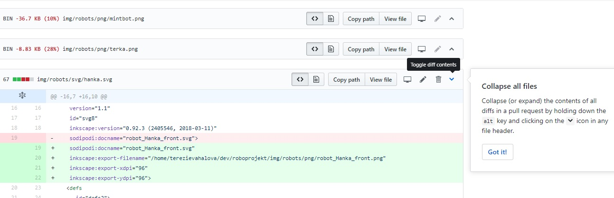

Title: Čtrnáctý sraz – opakování a vysvětlování
Date: 2019-01-15 08:39:00
Modified: 2019-01-15 08:39:00
Author: Iveta Česalová


Tento týden jsme se sešly v komorním počtu, navíc bez Petra. Ale cíl srazu byl jasný – abychom všechny rozuměly stávajícímu kódu.
Začaly jsme souborem *util.py* a procházely metodu po metodě jednotlivých tříd. Vášnivá diskuze nastala u třídy HoleTile, která volá metodu robota – `robot.die()`. Původně bylo v kódu napsáno, že si robot volal metodu díry, což Petrovi přišlo zvláštní :-) Nyní tedy metoda políčka vyvolá metodu robota, což je logičtější, než aby si robot vyvolal metodu políčka :-D

```python
class HoleTile(Tile):
    def kill_robot(self, robot):
        # Call robot's method for dying
        return robot.die()
```

Byla to dlouhá hodina, ale smysluplná. Potom jsme se přesunuly k souboru *backend.py* a následovalo další vysvětlování, což souviselo s opětovným probíráním pravidel hry.
Pokud robot umře, přiřadí se mu souřadnice [-1, -1], aby byl tedy mimo hrací plochu. Narazily jsme ovšem na problém, že když robot ožije, nemůžou se zobrazit dva roboti na sobě, pokud na jeho startovním políčku stojí jiný robot. Bude nutno se zamyslet, jak to vyřešit, jestli zobrazením dalšího okýnka, které se hráče zeptá, kam chce robota umístit, nebo náhodné rozmístění na volné startovní políčko…

Dalším tématem bylo Rozhraní, aneb pull request s několika stovkami řádků. Pro přehlednost jsme narazily na jednu vychytávku, pokud se na githubu mění velké množství souborů, stačí zmáčknout `alt` a kliknout na šipku a všechno se sroluje a snáze najdeme soubor, který potřebujeme.

 


Prošly jsme kód a ukázaly jsme si, co všechno funguje, jak už obrazovka reaguje na různé klávesy atd. Trochu jsme se pozastavily nad balíčkem karet. Budeme pokaždé rozdávat z nového, stejného balíčku karet, který se zamíchá a nebudou se tam vracet rozdané, které si hráč nevybere.

Příště se sejdeme již v plném počtu a určitě nás Petr nakopne správným směrem, jak dále pokračovat :-)
