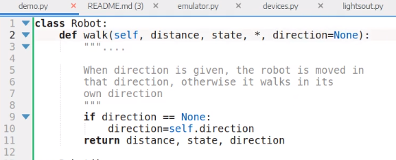

Title: Patnáctý sraz 
Date: 2019-01-22 18:00:00
Modified: 2019-01-23 09:58:00
Author: Anežka Müller

Tentokrát v kompletní sestavě. Na začátku jsme se shodly, že pro lepší porozumění tomu, kam se ve vývoji ubíráme, by stálo za to sepsat, jak má vlastně probíhat herní kolo, jaké kroky na sebe mají navazovat a co bude výsledkem. Ne konkrétně, jaké procesy se dějí na pozadí, skutečně jen jednotlivé fáze herního kola tak, jak by měly jít po sobě. Přestože jsme hru hrály a každá z nás měla představu, jak by hra měla probíhat, i toto jednoduché cvičení nám ukázalo, že některé věci nejsou napsané tak, jak by měly.

Řešily jsme také, že jednotlivé fáze hry, kdy roboti něco dělají, se ve hře jako takové musí dělat pomaleji, aby byly zaznamenatelné pohledem na herní plochu, případně aby hru provázel i textový zápis, co se děje. Ten by měl být součástí interaktivního rozhraní a měl by se objevit místo karet, ze kterých se vybírá program do jednotlivých registrů.

Dohodly jsme se, jak budeme postupovat, pokud robot ve hře ztratí všechny 3 životy. Vzhledem k tomu, že se to může ve hře stát poměrně rychle, přišlo nám škoda, aby daný hráč už nemohl hrát. Robot se tedy nevyřadí ze hry, ale pokaždé, když by měl ztratit další život, dostane permanentně jedno zranění, které nelze vyléčit.

Po úvodním ujasňování průběhu hry jsme se dostaly ke kódu. Karolina upozornila na některé řádky, které se v kódu několikrát (v některém případě hodněkrát) opakují. Zbavit se jich můžeme tím, že z nich uděláme funkce a pomocí zkratek, které nás Petr naučil v předchozích lekcích, můžeme i dané funkce znatelně zjednodušit. Například funkce
```python
def get_active_robots():
	active_robots = []
		for robot in robots:
			if robot.is_alive():
				active_robots.append(robot)
		return active_robots
```
může vypadat i takhle:
```python
def get_active_robots():
	return [robot for robot in robots if robot.is_alive()]
```

**Co kam a odkud?**

Kód naší hry je poměrně komplexní, jednotlivé části jsou spolu úzce provázané a občas není úplně jasné, kam by který kus kódu měl patřit a kde by se na něj mělo odkazovat, aby to zbytečně nekomplikovalo další vývoj. Například některá z metod políčka používá na provedení svého efektu metodu robota, která něco s robotem udělá, nevyužívá na to přímo některou z metod políčka. Dostaly jsme ohledně tohoto problému dvě rady. První je jednoduchá - říct si nahlas, jak se metoda jmenuje a co dělá. Na příkladu zabití robota - políčko umí sice robota zabít (`kill_robot()`), ale potřebuje si na to zavolat metodu robota, který sám ví, jak umřít (`robot.die()`). Políčko neví, jakým způsobem robot umí umřít, jde o implementační detail, který by měl být definován na jednom místě. Druhá rada říká, abychom psaly metody v kódu tak, aby bylo vždy co nejjednodušší přidat další prvek dané třídy. Ideální je zachovat funkčnost třídy na jednom místě. Tedy například všechna funkcionalita políček by měla být nadefinována v třídě políčka, aby se jednoduše dal přidat další typ. 

**Dekorátor property**

Python na rozdíl od jiných jazyků umí pracovat s atributy tak, aby se daly vypočítat. O to se stará dekorátor `property`. Atribut pak můžeme napsat jako metodu a dáme-li jí tento dekorátor, Python ji bude brát jako atribut. Nemusíme ji volat, přistoupíme k ní jako k atributu a provede se akce definovaná metodou. Tento atribut je ale pouze ke čtení. Chceme-li ho změnit nebo nastavit, musíme použít setter, ve kterém metodu nadefinujeme znova. 
```python
class Robot:
	def __init__(self, x, y):
		Self.x = x
		Self.y = y

	@property
	def position(self):
		Return self.x, self.y

	@position.setter
	def position(self, new_value):
		self.x, self.y = new_value
```

**Co ještě umí hvězdička?**

Na [jedenáctém srazu](https://roboprojekt.pyladies.cz/jedenacty-sraz) jsme se naučily, že v pokud na určité místo v pythonním kódu dám hvězdičku, dějí se věci. Zatím víme, že hvězdička umí označit nějakou sekvenci kódu a určit tím, že se budou používat jednotlivé prvky dané skevence. 
Hvězdička ale umí i jinou magii. Pokud ji použijeme v definici funkce, umí si vynutit pojmenovaný argument. 
Na příkladu níže to tak znamená, že pokud se přidá do metody `walk` jakýkoliv další argument za hvězdičku, vždy musí být zavolán pojmenovaný.



K čemu je to dobré? Když budeme danou funkci volat, bude už přímo ze zápisu volání funkce jasné, co daný argument znamená, není potřeba dívat se do kódu a hledat dokumentační řetězec pro danou funkci. Hodí se to pro případ, kdy má funkce řadu různých argumentů - usnadňuje to pak další práci s nimi a nevznikají zbytečné nejasnosti a chyby.

**Jak dělat věci lépe**

V závěrečné debatě o změnách v kódu jsme se bavily o některých "best practices" při vývoji v týmu - například pokud přejmenováváme nějaké funkce nebo proměnné, se kterými mohou pracovat i ostatní, je dobré o tom dát vědět. Stejně tak, když začleňujeme změny, které nejsou ideální. V tom případě je dobré rovnou vytvořit Issue, které zmiňuje, co není v pořádku a co je třeba opravit. 
Aby byl kód hezky čitelný a přehledný, je dobré dodržovat určité dané [konvence](https://www.python.org/dev/peps/pep-0008/). Kód jde naformátovat všelijak, Python se s tím popere, ale proto, aby se dalo s kódem dobře pracovat a jednoduše se v něm vyznat, jsou určité konvence velmi užitečné (například určité odsazování, mezery kolem operátorů apod.)
