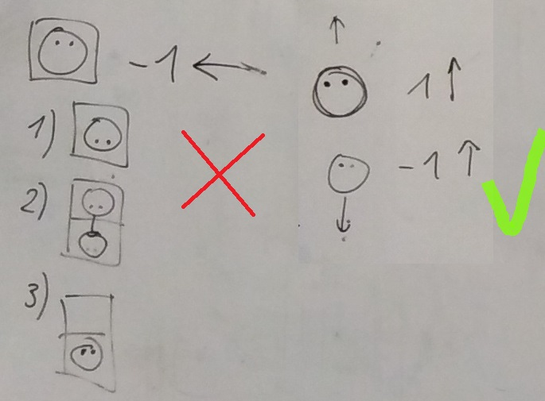

Title: Šestnáctý sraz - co máme a funguje - část I.
Date: 2019-02-05 18:00:00
Modified: 2019-02-05 09:58:00
Author: Iveta Česalová

Tento sraz byl opět v duchu velkého vysvětlování, co všechno již v kódu je a co funguje. Začali jsme základními soubory jako je README.md a narazily na malé nedostatky. Je nutno doplnit informaci o automatickém exportu obrázků pomocí `export_img.py`. Dále je lepší změnit `python -m pip install pyglet` na `python -m pip install -r requirements.txt`, v případě doplnění dalších potřebných programů (momentálně je v souboru requirements.txt pouze pyglet).


Hra se bude pouštět souborem `game.py`. V tomto souboru je nutno mít co nejméně kódu, který nejsme schopny testovat a bude spojovat všechny ostatní soubory dohromady. Je tam nyní pomocná funkce `def move_once(t)`, kterou je nutno odstranit. 
A narazily jsme na zásadní věc, jak vlastně hra bude fungovat, jak zadat příkazy, aby se již dalo hrát. Je nutno propojit s interface. Drobná chybička je v souboru `interface_frontend.py`, protože spouští aplikaci, což by neměl, protože jinak nepůjde importovat. Takže `window = init_window()` a `pyglet.app.run()` přesunout do `game.py`, z kterého se pustí dvě okna.


Pro zpřehlednění jsme vytvořily následující mapu, abychom věděly, která část kódu co obsahuje.


###BACKEND.PY###
Tady jsme narazily na problém ve třídě `Robot`, kdy v ` def_walk` je problém, když robot couvá. 
```python
if distance < 0:
            self.rotate(Rotation.U_TURN)
            self.walk((-distance), state)
            self.rotate(Rotation.U_TURN)
```

V případě, že jde na sever nebo na jih, není problém. Ovšem pokud má jít na západ, je to napsáno špatně. Je nutné ještě doplnit směr, kterým má jít.




Občas se nám objevuje duplicitní část kódu, například v metodách `def_walk`a `def_move`. Je tedy nutno vyřešit. Stejně tak máme v `def_apply_card_effect` dvakrát použitou podmínku `if_isinstance`, měli bychom na tuto část vytvořit metodu.


####Třída Robot####
V backendu ve vlastnostech robota se objevuje `self.path = path` a `self.path_front = path_front`. Jelikož se jedná o cestu k obrázkům, patří to do frontedu a pokud to chceme propojit, je vhodné místo toho robota pojmenovat.

V metodě `def_inactive(self)` jsou jako souřadnice neaktivního robota použity `(-1, -1)` . Nedávají nikdy smysl jako čísla (x, y), nutno změnit na `None`, protože robot v té chvíli není na hrací ploše.


###Třída Tile###
Třída `Tile` a všechny její podtřídy je velice obsáhlá a je v souboru `util.py`. Bylo by více než vhodné vytvořit samostatný soubor `tile.py`. 
Políčka (`Tile`) by měla jako `properties` dostat slovník jako např. `{'crossroads': True, 'direction': 90, 'count': 2}` a neměla by ignorovat jména vlastností.


Nejčastější chybou v celém kódu je pojmenování proměnných, jejichž název nesouhlasí přesně s tím, co dělá kód, nebo se liší od komentářů apod.

* `tile_count` se mezi `get_start_state` a `State.__init__` přejmenuje na `sizes`
* `State.game_round` se podle pravidel řekne `register`
*  v kódu je `next_coordinates`, v komentáři "new coordinates“
* `def_walk` - proměnná `robot_in_the_way = None` – je to číslo robota, ne robot
* v `util.py`- funkce se jmenuje `select_tile`, ovšem ona ho vybere a zároveň vytvoří

