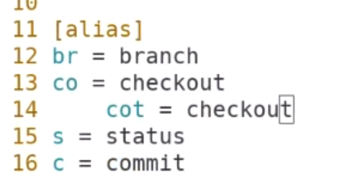
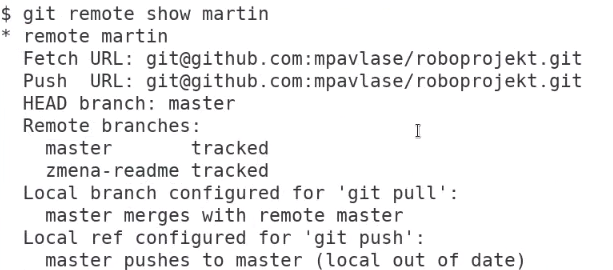
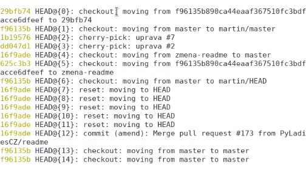
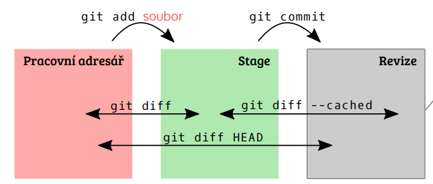

Title: Osmnáctý sraz - Odbočka: Git
Date: 2019-02-19 18:00:00
Modified: 2019-02-19 18:00:00
Author: Anežka Müller

Přestože Petr neměl tento týden prostor, rozhodly jsme se sarz nezrušit a domluvily jsme se s Martinem, který chodí koučovat začátečnické kurzy a chystá i nějaká témata na PyWorkingy, aby nám přišel ukázat rozšířené základy gitu. Přestože je používání gitu a GitHubu součástí našeho projektu, pracujeme pouze se základy, které jsme se naučily v rámci [PyLadies](https://naucse.python.cz/course/pyladies/git/basics/). Zajímalo nás, jaké jsou další možnosti, jak si s gitem ulehčit práci.

Jako první věc nám Martin ukázal, že si git můžeme přizpůsobit "na míru". Příkaz `git config --global` známe z [instalace gitu](https://naucse.python.cz/course/pyladies/git/install/), kde jsme jím nastavovaly uživatelské jméno a email. Pokud ale zadáme `git config --global -e`, dostaneme se do editovatelného nastavení, kde toho jde udělat mnohem více, například nastavit aliasy pro různé přikazy, které v gitu používáme. Můžeme si tak definovat vlastní zkratky i pro delší sekvence, nejen pro jednoslovné příkazy. 

Dostaly jsme ještě nějaké tipy k příkazové řádce obecně. Používáme pro pohyb v historii příkazů šipku nahoru, ale pomocí kombinace kláves Ctrl + R v ní mohu přímo vyhedávat zadáním požadovaného výrazu, najde jeho poslední výskyt. Pro zobrazení celé historie stačí zadat příkaz `history`.

### git stash

Poté, co jsme si pohrály s nastavením, posunuly jsme se k novým příkazům. Jako první přišel na řadu `git stash`. Tento příkaz může být užitečný například ve chvíli, kdy máme rozdělanou nějakou práci, ale náhle potřebujeme udělat něco jiného. Nechceme ještě dělat commit, ale můžeme využít stash, který uloží změny mimo větev, pouze lokálně. Stashů můžeme udělat tolik, kolik potřebujeme.
Stash se zobrazuje s pořadovým číslem, podle kterého je identifikovatelný: `stash@{0}`označuje nejnověji uložený, `stash@{1}` druhý nejnovější, atd. Pokud mu nepřidáme žádný popis, přiřadí se automaticky kód, který se vypíše za pořadové číslo. Pokud mu popis dáme, vypíše se místo kódu. 
Související příkazy:
`git stash list` vypíše seznam všech stashů
`git stash push -m "název"` dá stashi popis
`git stash pop` vytahuje věci ze stashe od nejnovějšího záznamu. Pokud za tento příkaz přidám pořadové číslo stashe, například `git stash pop stash@{3}`, vytáhne ten konkrétní stash.
`git stash drop` maže věci ze stashe od nejnovějšího záznamu, ale podobně jako pop umí mazat i konkrétní stash, pokud mu dám její pořadové číslo.
`git stash clear` kompletně vyčistí stash, smaže všechny uložené stashe
Git takto pracuje pouze se soubory, které zná, které už do něj byly přidány. Pokud máme nějaké, které ještě do gitu přidány nebyly a git je netrackuje, ale přesto je chceme dát do stashe, je potřeba zadat `git stash push --include-untracked`.
Výhoda i nevýhoda stashe spočívá právě v tom, že ukládá práci mimo větve, visí volně v prostoru. Můžeme pracovat v jedné větvi, dát věci do stashe, přesunout se do nové větve a tam si změny vytáhnout. V tom ale spočívá i slabina - o data lze snadno přijít. Jakmile zavřeme příkazovou řádku, stash se smaže. Jde v podstatě jen o dočasné úložiště rozpracovaných vecí.
Více ke stasthi lze najít v [dokumentaci](https://git-scm.com/docs/git-stash). 

### git remote

Git je distribuovaný systém, mohu tedy pracovat s různými repozitáři a posílat mezi nimi commity tak, jak se nám to hodí. Tím hlavním bývá `origin`, ale různých remote adresářů mohu mít celou řadu, pojmenovávat si je a předávat si mezi nimi změny apod. 
Příkaz `git remote add` spolu s názvem, jak si chceme daný remote pojmenovat, a adresou repozitáře na GitHubu přidá další remote do našeho gitového repozitáře. 
`git remote show` ukáže výpis všech remote adresářů, které máme přidané jako součást daného projektu. Pokud za to přidáme ještě název konkrétního remote, jak jsme si jej u sebe pojmenovaly, ukáže nám jeho detaily.

`git fetch "název remote"` se připojí na adresu remote repozitáře, stáhne si ho a označí vzdálené větve. Až pokud se na některou z nich budu chtít přeponout, přidá novou větev do našeho lokálního repozitáře. Git tedy o vzdálených větvích ví, ale lokální větev vytváří až tehdy, když se na ni přepnu. 

### git cherry-pick

Jedná se o příkaz, který umožňuje výběr konkrétních commitů libovolně z historie. 
`git cherry-pick` spolu s kódem commitu použije jen tento vybraný commit a udělá z něj nový commit na aktuální větvi, aplikuje změny z daného commitu. Pokud místo commitu napíšu název větve, je to jen jiný název commitu, na který daná větev ukazuje. Nevezme větev celou. 
Více k tomuto tématu viz [dokumentace](https://git-scm.com/docs/git-cherry-pick).

### git reset

Příkaz `git reset` umí rušit commity. Pokud za příkaz zadáme název commitu, přesuneme se na něj a tedy v rámci gitu do stavu, v jakém tehdy repozitář byl. Změny, které se staly v pozdějších commitech, nejsou nyní v gitu, ale existují v našem repozitáři. Pokud se jich chci zbavit a úplně se vrátit do předchozího stavu, existují dvě cesty. Buď po `git reset "název commitu"` zadám ještě `git checkout .` Druhá cesta je přímější, a to pomocí `git reset --hard "název commitu"` přímo pozmění repozitář do stavu v daném commitu a vše, co se stalo po něm, zahodí, včetně rozpracovaných věcí. 
Pomocníkem při pohybech po commitech může být `git reflog`. Git si pamatuje, jak se posouval ukazatel `HEAD` v rámci repozitáře, a `git reflog` vypíše historii všech těchto pohybů, včetně vymazaných commitů a také včetně provedených příkazů, které k pohybu vedly. Historie se ale čas od času promazává, nelze tedy jít libovolně dávno do minulosti.

V rámci gitu se pohybjeme v podstatě ve třech úrovních - viz obrázek níže. Vycházíme z našeho pracovního adresáře, kde máme vztvořený gitový repozitář. Dokud gitu neřekneme pomocí `git add`, aby sledoval nějaké změny, červenou barvou nám po zadání `git status` vypíše soubory, které v adresáři jsou, ale nesleduje je. Když vložíme soubor do gitu, přesune se do zelené oblasti, tzv. Stage, kde je již sleduje, ale stále s nimi můžeme pracovat, měnit je apod. 
Pokud máme soubor ve Stagi, ale chceme jej odebrat a vrátit zpět do pracovního adresáře, lze to pomocí `git reset -- "název souboru"`. 
Ze Stage pak pomocí příkazu `git commit` git sledované soubory zabalí, dá jim identifikátor, hlavičku, datum, email apod., vytvoří commit a uloží ho. 

*[Zdroj: Začátečnický kurz PyLadies](https://pyvec.github.io/cheatsheets/basic-git/basic-git-cs.pdf)*

### git rebase

Příkaz `git rebase` vykonává opakovaný `git cherry-pick`. Zadáme-li `git rebase "název větve"`, git se podívá, jak se od sebe dané větve liší a jaké jsou mezi nimi rozdílné commity. Postupně pak jednotlivé commity vezme a provede `git cherry-pick`. Důležité je pořadí větví. Ta větev, na které aktuálně jsem, slouží jako zdroj commit. Větev, kterou předáme jako parametr příkazu `git rebase`, bude ta, na kterou budou commity přibývat. 
Díky `git rebase` můžeme naši větěv přesouvat libovolně po "stromě" našeho projektu, tedy vlastně přepisovat jeho historii, narozdíl od `git merge`, který větve a změny v nich sloučí do jedné, ale jejich historii nechá paralelní. 
Pomocí `git rebase -i` se dostaneme do interaktivního módu, kde je možné měnit, co se pomocí `git rebase` má stát. Lze úplně vymazat některé commity, změnit commit message, upravit commit před jeho začleněním apod. Interaktivní mód obsahuje seznam commitů spolu s tím, jak se mají začlenit, a nápovědu, jak provést konkrétní úpravy.
Pěkný návod ke `git rebase` je například [zde](https://www.atlassian.com/git/tutorials/rewriting-history/git-rebase) a rozdíl mezi `git rebase` a `git merge`je pěkně popsaný například [tady](https://www.atlassian.com/git/tutorials/merging-vs-rebasing).

### git revert

Pomocí `git revert "název commitu"` provedu inverzní operaci ke `git commit`. Neodstraňuje ale změny z historie, nevrací se v ní zpět, narozdíl od `git reset`. Postupuje dopředu, ale provádí opačné změny, než udělal daný commit.

### Použití jen některých změn v souboru

Může se stát, že v nějakém souboru provedeme více změn, ale do commitu chceme dát jen některé z nich. K tomu slouží `git add -p "název souboru`. Otevře se nám celý zdrojový soubor s vyznačenými změnami a zkratkami akcí, které můžeme se změnami provést. Zadáním otazníku se vypíše nápověda k jednotlivým pokynům. Můžeme například vybrat, jestli změnu do commitu přidáme, nepřidáme, přidáme od dané změny všechny následující, vynecháme všechny následující, ještě před přidáním konkrétní změnu upravíme apod. `git commit` pak bude zahrnovat jen vybrané dílčí bloky daného souboru.
