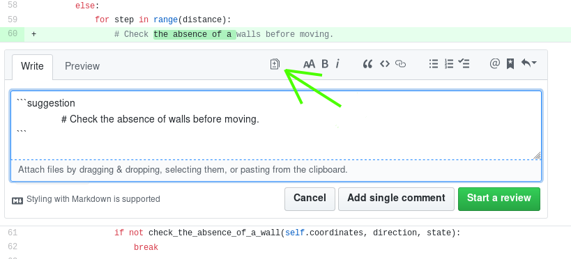

Title: Devatenáctý sraz - Tipy na vylepšení
Date: 2019-02-26 18:00:00
Modified: 2019-02-26 18:00:00
Author: Anežka Müller


### Testy, co nemají procházet

Při psaní testů mohou nastat situace, kdy potřebujeme ošetřit, že nějaký konkrétní test neprochází. Pro různé situace jsou vhodná různá řešení.

##### @pytest.mark.xfail
Tímto dekorátorem označujeme test, který zatím neprochází, ale počítáme s tím, že v budoucnu by procházet měl. Buď testuje kód, který ještě nebyl napsaný, nebo který ještě nefunguje, jak má. Lze mu přidat parametr `strict=True`, čímž zařídíme, že jakmile test začne procházet, celkově testy neprojdou a upozorní nás to tak na nutnost dekorátor umazat.

##### @pytest.mark.skip
Používáme v situaci, kdy ani nepočítáme s tím, že by test procházel. Při spouštění testů se takto označený test vždy přeskočí. Je možné přidat tomuto dekorátoru parametr `reason`, který pak v test reportu vypíše, proč byl test přeskočen.
```python
@pytest.mark.skip(reason="no way of currently testing this")
```

##### @pytest.mark.skipif
Tento dekorátor se používá pro případ, kdy se test přeskočí jen v určité situaci, za určitých podmínek. Například v konkrétním operačním systému nebo konkrétní verzi pythonu. Je třeba danou podmínku vydefinovat přímo za dekorátor, například takto:
```python
@pytest.mark.skipif(sys.version_info < (3,6),
                    reason="requires python3.6 or higher")
```
Při každém spouštění testů se zkontroluje u tohoto testu podmínka. Test se přeskočí, budou-li testy spouštěny v nižší verzi pythonu než 3.6. 
U použití tohoto dekorátoru je narozdíl od jednoduchého `skip` vždy při definování podmínky nutné zadat parametr `reason`, aby při výpisu výsledku testů byl jasný důvod, proč se test přeskočil.

Více k tomuto tématu najdeme v dokumentaci [pytestu](https://docs.pytest.org/en/latest/skipping.html), odkud pochází i ukázky kódu výše.

### Nástroje na kontrolu stylu - ano či ne?

V agendě pro dnešní setkání se také objevil dotaz, zda používáme nějaký nástroj na kontrolu stylu psaní kódu. V našem týmu je to v podstatě půl na půl. Některé z nás absolvovaly začátečnický kurz PyLadies dříve, než se v materiálech jako doporučovaný editor pro Win a Mac objevil Atom. Nyní je součástí materiálů pro samostudium jeho [instalace](https://naucse.python.cz/course/pyladies/beginners/install-editor/atom/) a příprava, kdy se mimo jiné instaluje [flake8](http://flake8.pycqa.org/en/latest/), nástroj, který hlídá konzistentní styl psaní kódu v pythonu na základě [PEP 8](https://www.python.org/dev/peps/pep-0008/). Flake8 v editoru barevně vyznačuje například příliš dlouhé řádky, mezery navíc, nadbytečné importy nebo třeba nepoužívané metody. Výsledkem by měl být lépe čitelný kód. 
Jestli podobné nástroje používat nebo ne je sporné. Nelze se na ně plně spoléhat, protože kontrolují jen věci, které jdou odhalit automaticky, a také ne vždy se jedná o chybný styl - někdy můžete například specifické formátování dělat záměrně, protože může dávat větší smysl a být čitelnější a přehlednější, než přesné následování pravidel PEP 8. Na druhou stranu třeba pro nováčky pracující ve větším týmu to může být nástroj užitečný, protože výsledkem jeho používání opravdu je lépe čitelný kód. 
Obecně je dobré PEP 8 znát, pochopit principy, které popisuje, a řídit se podle nich, protože zaručuje lepší čitelnost kódu nejen pro ty, kteří pravidla PEP 8 znají, ale celkově pro všechny. Navíc pokud bude číst kód někdo, kdo pravidla zná, odhalí na první pohled místa, kde je něco jinak a na která je třeba se více soustředit.
Od Petra jsme také dostaly tip na zajímavou přednášku [Beyond PEP 8](https://www.youtube.com/watch?v=wf-BqAjZb8M), která mimo jiné zmiňuje i situace, kdy postupovat podle PEP 8 nemusí být úplně nejvhodnější.

Jen pro dovysvětlení, [PEP](https://www.python.org/dev/peps/) je zkratka pro Python Enhancement Proposal, což jsou dokumenty pro vylepšení Pythonu nebo informační dokumenty o Pythonu. 

### Tipy pro GitHub

Před časem GitHub zavedl novinku v rámci code review, **suggested changes**. Díky ní je možné přímo na GitHubu v rámci pull requestu přímo navrhovat změny, které autor může jedním kliknutím odsouhlasit a začlenit. Je to příjemný rychlý způsob malých oprav například pro překlepy a drobné chyby, zatím je to ovšem pouze beta verze.



Další tip na zrychlení práce na GitHubu se týká issues. Existuje také rychlý způsob zavření issue, pokud je vyřešena pomocí nějakého pull requestu v tom samém repozitáři. Posíláme-li nějaký pull request týkající se konkrétní issue, a pokud by se začleněním tohoto PR issue zcela vyřešilo, lze do popisu PR nebo do commit message napsat určité klíčové slovo spolu s číslem issue, nebo lépe s celým URL konkrétní issue, například `Fix #135`. Jakmile se PR začlení, issue se automaticky zavře. Seznam všech klíčových slov lze najít [zde](https://help.github.com/en/articles/closing-issues-using-keywords). 

### Nebojme se dělat code reviews

Narazily jsme na problém, že část z nás si netroufá dělat code reviews, hlavně proto, že tolik nerozumí kódu jako jeho autorka, že je pro nás kód moc složitý. Code reviews ale nejsou jen o tom schválit, že kód je v pořádku a opravit případné chyby. Mohou také sloužit právě k lepšímu prozumění kódu. Když kód procházíme, je dobré se u věcí, kterým nerozimíme, zeptat, proč vypadají zrovna takhle, nebo co ten konkrétní kus kódu dělá. Ten, kdo kód psal, v něm už chyby tak snadno nevidí. Tím, že kód někomu vysvětlí, se také dají chyby odhalit. 

### Testovací framework pro funkční testy

Při procházení kódu jsme narazily na to, že nám v testech chybí, jak zjistit, zda je test jako takový správný a testuje, co má opravdu testovat. Aktuálně je třeba to kontrolovat manuálně, což není vždy úplně jednoduché.
Bylo by dobré vytvořit testovací framework, kód, který by zjednodušil vytváření funkčních testů. Například by test dostal adresář, kde by byla první mapa s roboty na konkrétních místech, textový soubor popisující, co se má stát během tahu, a výsledná mapa, která ukazuje, jak má kolo skončit. Test zkontroluje, že když dostane tuto mapu s roboty a tyto pokuny, po jejich provedení  bude výsledek takový, jako ukazuje druhá mapa. Cílem je zjistit, že souhlasí očekávaný výstup.


Ve větším by pak test uměl projít všechny testovací adresáře, kde by se daly testovat například všechny efekty políček, všechnu efekty karet apod. 
Práci bude dobré rozdelit na dvě části, udělat test, který se provede v daném adresáři, a pak test, který bude procházet všechny adresáře a postupně je otestuje.

Co se týče testů obecně, rády bychom je probraly podrobněji, stejně, jako jsme to v předchozích lekcích udělaly se zbytkem kódu, budeme jim tedy věnovat příští setkání.

### Propojení backendu a frontendu

Abychom se posunuly dál a aby byla hra hratelná, je třeba propojit herní logiku s vyobrazením. Nejedná se o jednoduchý úkol a budeme se muset naučit spoustu nových věcí. Protože se jedná o složitější problematiku, rozhodl se Petr udělat za dva týdnu misto klasického srazu trošku větší workshop, rozsahem přesahující naše běžná úterní setkání, takový menší PyWorking orientovaný na asynchroní programování a WebSockets. Sejdeme se na čtyři hodiny a setkání otevřeme i pro kouče, pro které by také mohlo být téma zajímavé. 
