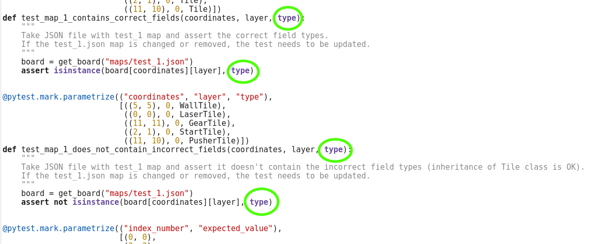

Title: Dvacátý sraz - Testy
Date: 2019-03-05 18:00:00
Modified: 2019-03-05 18:00:00
Author: Anežka Müller

Na předchozích setkáních jsme se věnovaly podrobnému procházení kódu, který jsme doposud daly dohromady. Další velká část, jejíž rozbor nás ještě čeká, jsou testy. Už na minulém srazu jsme je malinko nakously, dnes jsme se ale na oblast testů zaměřily podrobněji.

### Trochu jiné porovnávání

V našem projektu v rámci tvorby testovacího frameworku budeme potřebovat porovnávat dva stavy hry. Z úplných začátků PyLadies známe [porovnávání](https://naucse.python.cz/course/pyladies/beginners/comparisons/), jsme schopny pomocí porovnávacího operátoru `==` říci, zda se nějaké hodnoty rovnají nebo nerovnají. Výstupem je boolean hodnota `True` v případě rovnosti a `False` v případě nerovnosti. Pokud však potřebujeme porovnat například různé objekty stejné třídy, které v základním nastavení porovnávání budou vždy různé, potřebujeme operátor `==` předefinovat. Třeba v následujícím kódu řekneme, že všechny objekty třídy A jsou si rovny:
```python
class A:
    def __eq__(self, other):
        if isinstance(other, A):
            return True
        else:
            return False
```

Pokud nadefinujeme `__eq__`, automaticky se předefinuje i porovnávací operátor `__ne__`, tedy `!=`. Pokud bychom chtěly předefinovat i další porovnávací operátory, zde jsou jednotlivé zkratky:  
`__lt__` je označení pro `<`  
`__gt__` pro  `>`  
`__le__` pro  `<=`  
`__ge__` pro  `>=`

### Odbočka - isinstance a issubclass

Při nastavení porovnávání v příkladu výše jsme v kódu použily `isinstance`. Protože potřebuji zjistit, zda se rovnají objekty dané třídy, není nejvhodnějším řešením jednoduše porovnat typy objektů pomocí `type`. Může se stát, že budu porovnávat objekty jedné třídy s jinou, která z té první dědí. Pak by porovnání `type` mělo za výsledek `False`, protože se skutečně jedná o jiné třídy. `isinstance` je ale schopno zjistit, zda se jedná o objekt dané třídy, i když se jedná o podtřídu. Použití `isinstance` je ale často pouze zkratkou, která ukazuje, že program není úplně dobře navržen a dal by se napsat lépe.
Podobnou funkcí je `issubclass`, která přímo zjišťuje, zda je daná třída podtřídou druhé třídy. 

### Nedostatky v našem kódu

Ne všechny nedostatky a připomínky jsou specifické pro testy, přestože jsme na ně narazily při procházení testovacích modulů. Některé se dají aplikovat plošně na psaní kódu a vedou k jeho lepší čitelnosti a srozumitelnosti. 

#### Názvy proměnných

První z této skupiny jsou názvy proměnných. Vytváříme-li nějakou proměnnou, která se bude používat v celém modulu, je dobré je pojmenovat dostatečně specificky tak, aby z ní bylo jasné, co skutečně obsahuje, ideálně včetně datového typu. Příklad z našeho kódu - na začátku jednoho z testovacích modulů vytváříme seznam cest k mapám, který byl pojmenován `maps`. Neobsahuje ale mapy, pouze cesty k nim. Název je tedy poměrně matoucí, mohly bychom spíše čekat, že seznam bude obsahovat například JSONy map. Mnohem lepší název je tedy `all_map_paths`, který jasně říká, co od proměnné můžeme čekat.
Další problém s názvem proměnné jsme odhalily o kus dál. Všimly jsme si, že editor nám v kódu zabarvuje proměnnou `type` (viz obrázek). 



Nejedná se o klíčové slovo, můžeme ho použít jako název proměnné, ale je to již (podobně jako `print`) nadefinovaná funkce, kteráJaké testy by měly v projektu ještě být vrací typ objektu. Krom toho je to také třída. Například `int` je objekt třídy `type`. My ale `type` v našem kódu používáme ve vztahu k vlastnostem políček na mapě. To ale není vhodné, od `type` jsou podobně jako od `print` očekávány nějaké konkrétní výstupy, není tedy dobře tyto věci předefinovávat. Pokud chceme použít nějaké generické jméno, které by již mohlo mít nějakou hodnotu nebo funkci, je lépe toto jméno více specifikovat.

#### Komentáře a dokumentační řetězce

Při procházení jednoho z testovacích modulů se ukázalo, že neumíme správně pracovat s komentáři a dokumentačními řetězci. Narazily jsme například v těle kódu na komentář, který hovoří o celém souboru. Takový text je ale poměrně důležitý, říká, k čemu soubor slouží. Měl tedy být dokumentačním řetězcem celého modulu a měl by být umístěn hned na začátku celého souboru (ještě před importy).  
Důležité je také rozlišovat mezi dokumentačními řetězci a komentáři. Dokumentační řetězec popisuje chování modulu, funkce nebo třídy a je umístěn na začátku té části kódu, ke které se vztahuje. Dokumentační řetězce slouží člověku, který danou věc používá, aby věděl, k čemu slouží.
Oproti tomu komentáře slouží těm, kteří čtou kód a potřebují zjistit, jak funguje. Vysvětlují například různé proměnné, použití konkrétních věcí v kódu apod.  
Důležité také je dokumentační řetězce i komentáře __aktualizovat__. S kódem pracujeme pořád, vylepšujeme ho a měníme. Na komentáře ale často zapomínáme. Může se tak stát, že v komentáři nebo dokumentačním řetězci narazíme na něco, co již dávno v kódu nepoužíváme. Pro člověka, který kód vidí poprvé nebo jej nezná tak dobře jako autor, může být taková věc hodně matoucí. Proto je potřeba při změnách kódu myslet i na úpravy doprovodných textů, aby dávaly smysl.


#### Zbytečné testy?

Občas jsme narazily i na testy, které nemají pro kód žádnou přidanou hodnotu. Je dobré si u každého testu říct, co přináší, zda to, co testují, je skutečně potřeba testovat apod. Pokud nedokážeme najít nic, čím by takový test mohl být užitečný, že to je jen test pro test, můžeme ho s čistým svědomím smazat.   
Podobně je na tom i testování pomocných funkcí. Někdy může být dobré otestovat pomocnou funkci, na druhou stranu pokud zjistíme, že ji už nepotřebujeme, nestačí smazat pouze tuto pomocnou funkci, musíme také myslet na to, že je třeba smazat i její test.   
Podobné testy mohou být i relikty z dřívějších fází vývoje, kdy byl stav kódu takový, že daná funkce byla důležitá, potřebovala otestovat a dávalo to smysl. Pokud se ve vývoji posuneme dále a test už se může zdát nadbytečný, protože netestuje nic důležitého, stále může mít v kódu svoje místo. Takovým testům se říká __regresní__ testy a jejich úkolem je testovat, že se daná funkce nezmění. 

#### Odbočka - Malá zákeřnost Pythonu 3

V naší sadě testů se objevoval jeden, který měl zajímavý výstup. Vždy prošel, pokud se spouštěl v Pythonu 3.6, a vždy spadl, pokud se spouštěl v nižší verzi.  
V kódu hodně pracujeme se slovníky. V předchozích verzích Pythonu 3 neměly slovníky dané pořadí, vypisovaly se různě. Slovník sám si nepamatoval, v jakém pořadí se do něj vkládaly prvky, na pořadí, v jakém se vypíší, se tedy nedalo spoléhat. Fungovalo ale velmi rychle vyhledávání podle klíče. V Pythonu 2 se sice slovníky vypisovaly vždy stejně, ale zabíraly více paměti a vyhledávání v nich bylo pomalejší. Od verze Pythonu 3.6 jsou slovníky opět seřazené, protože někdo vymyslel, jak to udělat, aby byly stále rychlé, spotřebovávaly méně paměti, ale zároveň zůstaly stejně seřazené. Náš problém tedy spočíval právě v tom, že daný test počítal s konkrétním seřazením slovníku, v Pythonu 3.5 tedy občas padal.

### Testujeme vše, co je třeba?

U testů obecně je dobré se zaměřit nejen na to, jaké testy máme a v jakém jsou stavu, ale také na to, jaké testy ještě nemáme a měly bychom mít. Absenci testů jednoduše nepoznáme. Je třeba si celý kód projít, zaměřit se na všechny důležité funkce v něm a podívat se, zda jsou (dostatečně) otestované.  
Pokud bychom testy nepsaly, kód pravděpodobně bude fungovat dál, mohou se však do něj nepozorovaně vkrádat drobné chyby, které by nám mohly jednoho dne přerůst přes hlavu. Testy je tedy určitě dobré nepodceňovat. 
