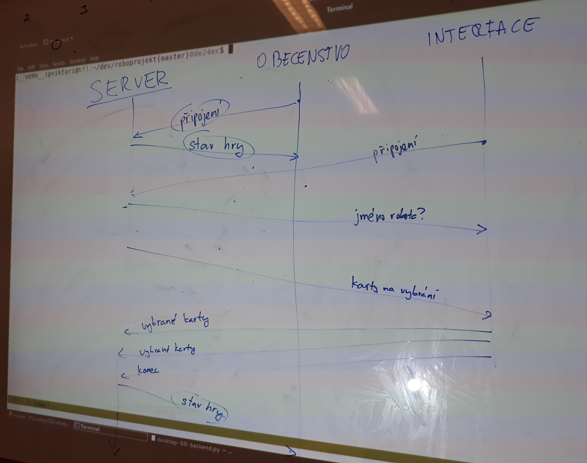

Title: Dvacátý třetí sraz - Opakování a první krůčky se serverem
Date: 2019-03-26 18:00:00
Modified: 2019-03-26 18:00:00
Author: Anežka Müller

V rámci retrospektivy, co se událo za poslední týden, jsme narazily na několik nejasností v rámci tříd. V našem projektu hrají třídy podstatnou roli, umožňují nám celý kód výrazně zjednodušit, zpřehlednit a zefektivnit. Proto jsme se rozhodly pro malé opakování, abychom si osvěžily informace ze [začátečnického kurzu](https://naucse.python.cz/2019/brno-jaro-2019-pondeli/beginners/class/).

Při vytváření tříd je neopomenutelným parametrem jejích atributů a metod `self`, které vyjadřuje konkrétní objekt dané třídy. Při volání metody na konkrétní objekt pak metoda místo `self` dostává objekt, na kterém je metoda volána.

Konkrétním objektům třídy můžeme definovat atributy i bez toho, aby byly "vynucené" metodou `__init__`, která říká, jaké atributy musí mít všechny objekty dané třídy a které je třeba nadefinovat již při vytváření objektu. 

Stejně jako u jiných částí kódu, i u metod třídy je dobré se dívat, zda něco zbytečně neduplikujeme. Z hlediska fází hry nebo pojmenování nějaké metody může dávat smysl mít části rozdělené a metody pak volat podle názvu v té fázi hry, kde se lépe hodí, pokud však mají většinu obsahu shodnou, je dobré se zamyslet nad tím, zda by nebylo lépe kód sjednotit pod jednu metodu, která bude obecněji uplatnitelná. Příkladem z našeho kódu budiž metody `Walk` a `Move`, které obě patří třídě `Robot`. Jednu používáme, pokud se robot pohybuje na základě programu, který mu zadáme pomocí karet, druhou pak, pokud robotem hýbe nějaká jiná vnější příčina. Každá sice dělá něco jiného a používá se v jiné situaci, ale vnitřek se liší pouze tím, že v druhém případě se metoda neprovede, pokud na políčku, na které by se měl robot posunout, již nějaký robot stojí. (Dle pravidel při tomto pohybu nemá robot dostatečnou sílu na to pohnout jiným robotem a odsunout jej.) Pokud tedy ošetříme tuto část, můžeme nechat plný kód pouze v jedné z metod a v druhé ji pak pouze zavolat se správnými argumenty.
Případně je ještě možné společnou část kódu vydělit do pomocné funkce (označujeme s `_` na začátku názvu funkce) a tu pak použít v obou původních funkcích.

### OrderedDict

Doposud jsme v kódu pracovaly se seznamem startovních políček bez jakýchkoliv dalších detailů. Pro hru ale potřebujeme krom polohy startovních políček ještě několik doplňujícíh informací, například kterým směrem jsou orientována, a také potřebujeme, aby záznamy zůstávaly ve stejném pořadí. Karolina se rozhodla předělat seznam na slovník, kde klíčem bude číslo políčka a hodnotami budou směr a souřadnice. Starší verze Pythonu ale náhodně mění pořadí položek ve slovníku, bylo tedy třeba použít knihovnu `Collections` a z ní třídu [OrderedDict](https://docs.python.org/3/library/collections.html#collections.OrderedDict), která starším verzím Pythonu přidává schopnost držet záznamy ve slovníku v takovém pořadí, v jakém jsou do něj vkládány. Od Pythonu 3.7 výše je tato vlastnost slovníků přímo zaintegrovaná do Pythonu. 

### Tvoříme server!

Před dvěma týdny jsme místo klasického setkání měly delší workshop zaměřený na [asynchronní programování a síťovou komunikaci](https://roboprojekt.pyladies.cz/dvacaty-prvni-sraz-workshop). Dnes jsme poprvé podrobněji rozebraly, k čemu nově nabyté informace využijeme v našem projektu. Cílem je, aby hra byla hratelná i jinak, než že si ji člověk spustí na svém počítači, v ideálním případě bude běžet někde na serveru a budou se k ní připojovat jednotliví hráči. Potřebujeme tedy vytvořit server, který bude znát stav hry, bude s ním umět pracovat, posílat ho připojeným klientům a zpracovávat změny. V rozdělení, jaké máme teď, budeme pracovat se dvěma typy klientů, první bude pouze pro zobrazení herní plochy, kterou si může zobrazit kdokoliv, aniž by nutně musel hru přímo hrát (na obrázku jako Obecenstvo), druhý pak bude samotné ovládání hry pro hráče (na obrázku jako Interface) - tento klient, když se připojí k serveru, dostane informaci, za jakého robota hraje, bude vybírat karty a odesílat je zpět na server apod. 

Na začátek ale nebudeme řešit síťovou komunikaci tak, jak je popsána výše. Potřebujeme začít s něčím jednodušším a můžeme se vydat dvěma cestami.
První možnost je vytvořit jednoduchý prototyp "serveru" s využitím printu a inputu, který bude umět vypsat zprávu s mapou a zprávu se stavem hry a bude se umět zeptat na vybrané karty. Až budeme tohle mít hotové, můžeme navrhnout klienta pro "obecenstvo", který se bude umět zeptat na stav hry a pak ho vypsat, a klienta pro herní "interface", který se bude umět zeptat na jméno robota a vypsat vybrané karty. Tak si navrhneme logiku, na které bude založená budoucí komunikace, a můžeme ji dále rozpracovávat. 
Druhá možnost je začít od vytovření komunikačního kanálu a navrhnout za využití AsyncIO jednoduchý chatovací prográmek, ke kterému se bude dát připojit a který bude umět přijímat zprávy a posílat je dál všem připojeným klientům. Toto je cesta, kterou jsme se rozhodly vydat, protože můžeme rovnou využít informace a materiály z proběhlého workshopu. Začneme jednoduše vytvořením dvou testovacích klientů, jeden bude pouze přijímat informace ze serveru a druhý je bude serveru pouze odesílat. Co se týče serveru, je třeba zařídit, aby rozesílal informace všem připojeným klientům a aby uměl reagovat na zprávy. 

Potřebovaly jsme si ujasnit, jaké je propojení našeho stávajícího kódu a přechodu na mód server-klient. Nyní je náš stav hry, se kterým by měl později operovart server, vytvářen modulem `game.py`. Můžeme tedy obsah tohoto modulu přenést do našeho serveru. Ten si pak bude vytářet stav hry, pamatovat si ho, pracovat s ním (upravovat na základě vstupů od klientů) a informace o něm rozesílat klientům. 
Server a klienti by si měli umět posílat informace v nějakém smysluplném datovém formátu. Protože už umíme obstojně pracovat s formátem JSON, využijeme ho i tady. Bude tedy potřeba vymyslet, jak vše, co obsahuje stav hry, převést na slovník - každý jednotlivý aspekt stavu hry by se měl umět popsat. Server z něj pak vytovří JSON, který bude posílat dál. 
