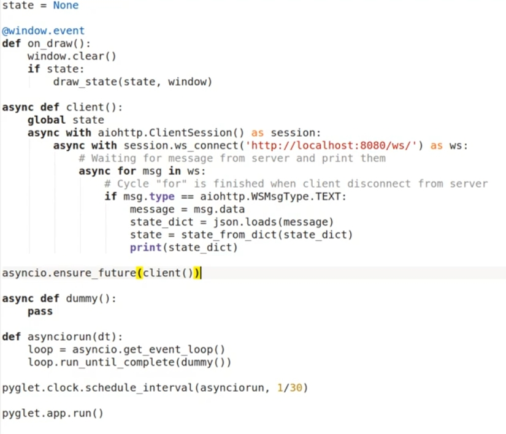

Title: Vylepšování klientů, propojení Pygletu a asyncio
Date: 2019-05-21 18:00:00
Modified: 2019-05-21 18:00:00
Author: Anežka Müller

## __init__.py

Při zpracovávání testovacího frameworku jsme narazily na problém, kdy chceme spouštět testy z hlavního adresáře RoboProjektu, ale soubory s testy máme přesunuty do podsložky `tests`. 
Po přesunutí do této složky začal pytest při spouštění testů hlásit chybu, kterou vyřešilo přidání prázdného souboru `__init__.py`. 
Zajímala nás tedy magie za tím.
Petr nám vysvětlil, že tento soubor udělá z daného adresáře pythonní modul. 
Když používáme testy ze stejného adresáře, ze kterého je voláme, není tento soubor potřeba, protože dosáhneme na jednotlivé soubory, které importujeme jako moduly. 

## @classmethod

Při předělávání hry do podoby server - klient potřebujeme na straně klienta "dekódovat" data zaslaná serverem v podobě JSON souboru a vytvořit z nich stav hry, se kterým budeme moci dál pracovat. 
Proto jsme vytvořily funkci `state_from_dict`, která umí vše potřebné vyextrahovat a vytvořit objekt třídy `State`. 
Takové funkci se říká `factory`, protože vytváří nové objekty. 
Je to alternativa `__init__` funkce dané třídy, jen vytváří objekt z jiných vstupů. 
Funkce stála mimo danou třídu, což je malinko nepřehledné. 
Petr nám proto ukázal, jak z ní udělat metodu dané třídy. 
Problematické je zde `self`, které daná funkce nemůže brát jako argument, protože ještě žádné `self` neexistuje.
Problém řeší použití třídní metody s dekorátorem `@classmethod`, která místo `self` bere jako argument `cls`, tedy třídu. 
Je to metoda, která neumí pracovat na nějaké instanci dané třídy, ale pracuje přímo se třídou.
Používá se často právě v případech, kdy existuje více možností, jak vytvořit objekt nějaké třídy. 

## Propojení Pygletu a asynchronních funkcí

Pyglet nepodporuje asynchronní programování, proto pro náš projekt potřebujeme zjistit, jak spojit tyto dvě věci dohromady. 
Obě spouštěcí funkce, `pyglet.app.run()` i `asyncio.run()` spouští nějaké smyčky událostí zahrnující reakci na nějaký vstup.
Koncept asynchronního programování je poměrně starý a dřívě existovala řada knihoven, které pracovaly se zpracováváním více úloh a čekáním na komunikaci po internetu a které mezi sebou nebyly kompatibilní, každá používala svoji konkrétní smyčku událostí. 
Aby se do budoucna předešlo problémům, ustanovila se právě knihovna asyncio a stala se obecně používanou. 
Jakákoliv aplikace, která chce komunikovat po internetu a umí zpracovávat asyncio smyčku, se dá použít s jakoukoliv jinou knihovnou, která umí asyncio. 
Bohužel Pyglet mezi tyto aplikace zatím nepatří a asyncio neumí. 
Čeho můžeme využít - asyncio čeká na nějakou událost a když ji zpracuje o chviličku později, nic zásadního se nestane. 
Můžeme tedy říct Pygletu, aby např.třicetkrát za vteřinu spustil kousek asyncio smyčky.
Pyglet tedy bude řídit to, kdy mohou běžet asynchronní operace. 
Pro tuto implementaci bude potřeba použít něco trochu složitějšího než `asyncio.run()`, konkrétně pracovat s celými smyčkami událostí, které je třeba naplánovat a spustit. 
Smyčku nadefinujeme pomocí `loop`, kde využijeme funkce `run_until_complete`, která zajistí, aby se smyčka událostí běžela, dokud neskončí úkol nadefinovaný jako argument této funkce. 
Takto nadefinovaný úkol se naplánuje na poslední místo za všechny úkoly, které už čekají na zpracování. 
Pro naplánování spuštění klienta pak použijeme funkci `ensure_future()`, kde se jako argument zadá funkce, kterou takto chceme spustit.
Více o použitých funkcích najdeme v dokumentaci k asyncio o [smyčkách](https://docs.python.org/3/library/asyncio-eventloop.html) a [funkci `ensure_future`](https://docs.python.org/3/library/asyncio-future.html). 
Kód pak může vypadat například takto:

