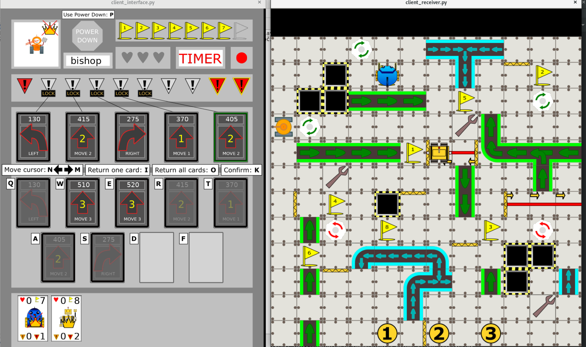

Title: Hrajeme!
Date: 2019-09-10 18:00:00
Modified: 2019-09-10 18:00:00
Author: Anežka Müller

Dnes jsme se sešly bez Petra, ale s návodem, jak spustit hru skutečně jako multiplayer!
Podařilo se nám po drobných počátečních klopýtnutích úspěšně překonat nástrahy firewallu a jiných překážek ve spojení počítačů a hru skutečně spustit!
A nejen spustit, ale i dohrát do fáze, kdy jedna z nás vyhrála.

Aktuálně je hra nastavená tak, že i po vítězství jednoho z hráčů pokračuje dál.
Většina věcí funguje dle našich představ, krom několika drobností, které budeme ještě upravovat.
Hrály jsme celkem asi hodinu, než jsme narazily na bug, který hru shodil.
Zbytek setkání jsme tedy věnovaly tomu, abychom zjistily, co je špatně a jak to opravit :) 
Zkoumáním error message jsme došly k tomu, že si naše hra neumí poradit s tím, když robot umře během provádění příkazu jednoho registru. 
Například má jít o tři políčka rovně, ale hned na prvním je díra - po prvním kroku tedy umře, ale hra nyní počítá s tím, že musí pohyb dokončit a chce robota přesunout na další koordináty, které se ale v okamžiku smrti nastaví na `none`. 
Alespoň se tak domníváme. 
Bohužel se nám nyní vykresluje naráz výsledek provedení všech tahů herního kola a nemáme ještě zpracovaný log, špatně se nám tedy zpětně rekonstruují pohyby robotů.
Budeme ale pracovat s touto teorií a uvidíme :)

Než jsme setkání rozpustily, otevřely jsme téma, v jaké fázi budeme s výsledkem RoboProjektu spokojeny. 
Každá z nás to má trošku jinak, budeme se nad tím tedy ještě muset zamyslet a vytyčit nějakou konkrétní uspokojivou podobu hry, abychom byly schopny někdy vůbec dosáhnout cíle :) 
