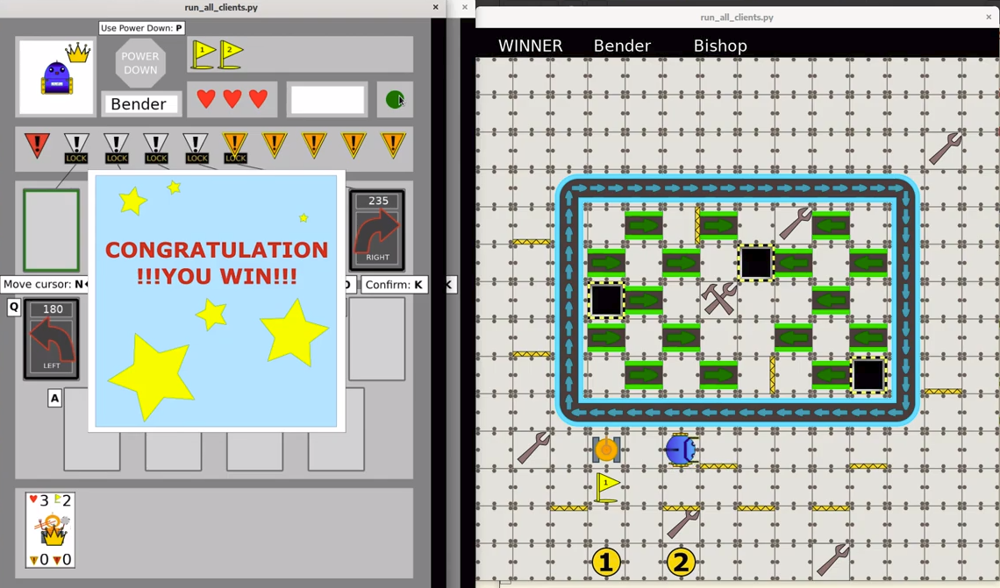

Title: Předposlední sraz - Finishujeme!
Date: 2019-11-19 18:00:00
Modified: 2019-11-19 18:00:00
Author: Anežka Müller

Původně byl náš projektový kurz zamýšlený jako semestrální. 
Ukázalo se, že to bude mnohem víc práce, než jsme si dovedly představit, takže se scházíme už déle než rok. 
Abychom stanovily nějaký konec, dohodly jsem se, že Roboprojekt uzavřeme během listopadu. 
Čekala nás tedy dvě poslední setkání na doladění a učesání aktuálního stavu.


Při procházení posledních úprav jsme narazily na kus kódu, jehož zápisu většina z nás nerozuměla. 
```python
return default if len(sys.argv) == 1 else sys.argv[1]
```

Petr nám vysvětlil, že jde o specifický druh operátoru.
Operátory můžeme dělit podle počtu operandů, se kterými pracují. 
Běžne se i v kódu setkáváme s operátory __unární__, například `-1`, a __binární__ (`1 + 1`, `3 % 6`, nebo `True or False`). 
Zde se jedná o __ternární operátor__, takovým se v Pythonu říká také podmíněné výrazy, __conditional expressions__. 
V podstatě umožňují napsat podmínkovou if-else část kódu pouze na jeden řádek. 
Vysvětleno například [zde](https://www.geeksforgeeks.org/ternary-operator-in-python/).

V našem případě jde tedy jen o jiný zápis
```python
if len(sys.argv) == 1:
    return default
else: 
    return sys.argv[1]
```

Dobrá praxe ve sdílených projektech nicméně je používat zápis, který je srozumitelný většině. 
Přestože jsme se tedy naučily něco nového, bylo by lepší použít druhou, běžnější variantu.


### Věci k dořešení do budoucna

Sepsaly jsme do projektu několik věcí, které ještě nejsou v ideálním stavu, i bez nich je ale možné vypustit projekt do světa.
Mezi takové patří složka s mapami, které jsou již vytvořené.
Aktuálně jsou všechny ve stejném adresáři a je v nich trochu nepořádek.
Stálo by za to mapy rozdělit do smysluplných celků, dát stranou testovací mapy a vlastně celkově mapy udělat hezčí, což vyžaduje nějakou práci s grafikou stávajícíh obrázků.


Dalším bodem k řešení je odpojování a opětovné připojování klientů do hry. 
V nyní navrženém řešení to nefunguje optimálně. 
Když se klient odpojí a znovu připojí v aktuálně běžícím kole, může si znovu vybírat karty, i když už předtím potvrdil výběr. 


V budoucnu by také bylo dobré, aby se na serveru dalo hrát více her. 
Variant je více, neklademe si ale ambice toto vyřešit do příštího, posledního setkání. 


### Game Log

Když jsme poprvé hru spustily tak, že se dala hrát, shodly jsme se, že by bylo fajn, aby byl na herní ploše znatelný průběh jednotlivých fází herního kola.
Zatím se vše vyhodnocovalo zaráz a byl viditelný vždy jen konečný stav.
Dohodly jsme se, že vytvoříme __game log__, což bude soupis jednotlivých kroků tak, jak se mají dít postupně v herním kole. 
Potřebujeme ho, abychom byly schopny "animovat" pohyb na herní ploše, aby bylo viditelné, kam se roboti točí, hýbají apod.

Podstatou řešení, které jsme dokončily za pomoci Petra na dnešním srazu, je to, že změny stavu hry vytvoří zmiňovaný game log, který budou dostávat višchni klienti. 
Nebudou pokaždé dostávat celý log znovu, ale vždy jen tu část, která ještě nebyla poslaná. 
Část logu, kterou dostanou, se pak bude krok po kroku zpracovávat, provádět a vykreslovat, čímž dojde k postupné "animaci" na herní ploše.
Dokončení game logu nám zabralo skoro celý zbytech schůzky, ale nakonec bylo dosaženo vítězství! :)




### Jak celý projekt uzavřeme?

Dohodly jsme se, že poslední schůzku budeme mít příští týden, a doladíme na ní věci nezbytné k tomu, aby byl projekt uveřejnitelný. 
Jako oficiální závěr pak bude mít na listopadovém brněnském [Pyvu](https://pyvo.cz/brno-pyvo/) Karolina krátkou přednášku o Roboprojektu z technického pohledu, o jeho budoucnosti a o tom, jak se do něj může kdokoliv zapojit. 
