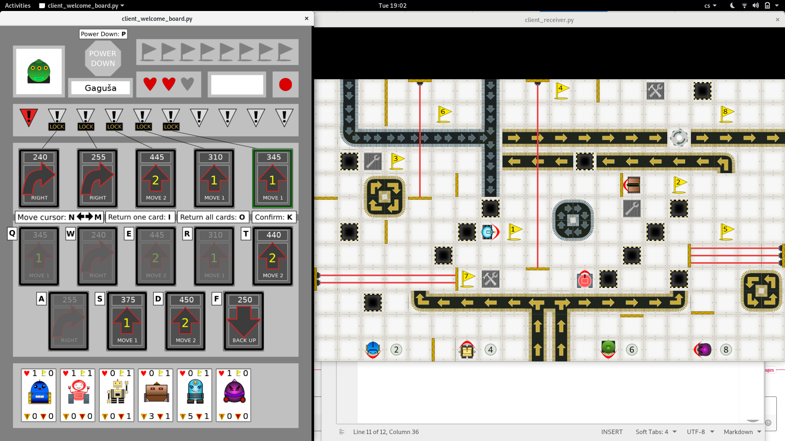
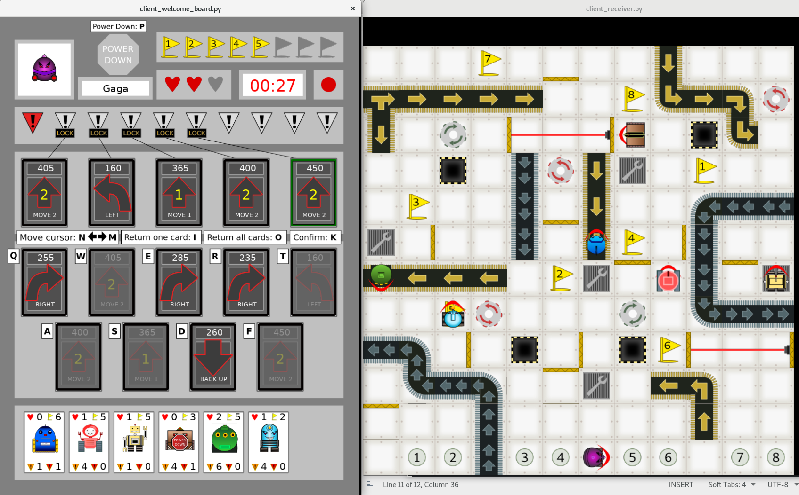
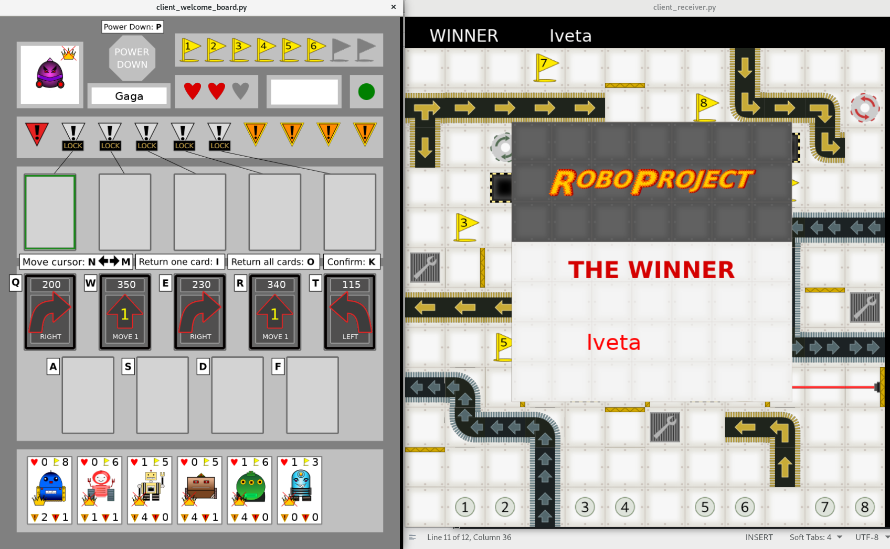

Title: Poslední sraz
Date: 2019-11-26 18:00:00
Modified: 2019-11-26 18:00:00
Author: Anežka Müller

Dnes se scházíme naposled. 
Čeká nás finální opravování zásadních chyb, které mohou ovlivnit aktuální hratelnost hry, chceme doladit nějaké drobnosti a především otestovat hru v maximálním možném počtu hráčů.
Od minulého setkání prošla hra většími proměnami z hlediska grafiky a podařilo se vyřešit téměř všechno, co jsme si vytyčily pro úspěšné ukonční projektu.

Na začátku jsme ještě doplily poslední důležitou věc, možnost nastavení nižšího počtu hráčů i v mapách pro více hráčů a pak už nic nebránilo testování hry.

Aby nás bylo co nejvíce, pozvaly jsme si i posilu a tak nás i dohromady s Petrem bylo sedm.
Vtéto sestavě jsme vyzykoušeli dvě mapy.
První byla v takto velkém počtu hráčů téměř nehratelná, ale byla to velká zábava (a velká řež).

Takováto mapa by byla obtížná i v menším počtu hráčů, ale v sedmi lidech na ní bylo prakticky nemožné vyhrát.
Přibližně po hodině hraní jsme vzdali pokusy dostat se dál než na čtvrtou vlajku a zvolili jednodušší mapu.

Ta už nám umožnila otestovat i výhru :)

Z testování vyplynulo ještě několik drobností.
Líbilo by se nám, kdyby bylo na mapě patrné, kde má který robot aktuální startovací políčko. 
Může se nám také stát, že když se má robot znovu objevit na svém aktuálním startovacím políčku a stojí na něm v tu chvíli jiný robot, stojí pak na sobě a překrývají se.
To by se dít nemělo a je třeba to vyřešit.
Testovací hry také ukázaly, že nám chybí větší množství jednodušších, lépe hratelných map.
Uvidíme, kolik z toho se nám podaří do čtvrtka vyřešit.

### Co bude dál?

Přestože bude projektový kurz ve čtvrtek oficiálně ukončený, neznamená to, že na projektu nebudeme dál pracovat.
Je to něco, s čím žijeme více než rok, věřím tedy, že některé z nás určitě budou chtít kód dále vylepšovat.
Velkým krokem ale bude to, že ho veřejně představíme komunitě. 
Dá se tedy čekat, že se do vývoje zapojí i další lidé a Roboprojekt si tedy bude více žít vlastním životem.

### Poděkování na závěr

Roboprojekt byl experiementální kurz.
Nikdo z nás na začátku netušil, kam se to celé vyvine a co nás všechno čeká.
Ráda bych poděkovala Petrovi, že se rozhodl takový kurz vést, že to s námi vydržel tak dlouho, za to, kolik nás toho naučil a jakou s námi měl trpělivost.
Poděkování patří také společnosti [Kinali](https://www.kinali.cz/cs/), která nám dovolila využívat tak dlouho jejich meetingovou místnost.
A v neposlední řadě všem, co se na Roboprojektu podíleli, že dali vzniknout fantastické hře, kterou si už každý může zkusit zahrát!

Chcete si hru zahrát nebo se zapojit? Roboprojekt najdete [na GitHubu](https://github.com/PyLadiesCZ/roboprojekt)!
