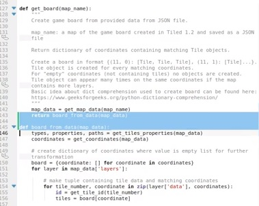

Title: Dvacátý pátý sraz - po delší době
Date: 2019-05-14 18:00:00
Modified: 2019-05-14 18:00:00
Author: Anežka Müller

Dnešní sraz proběhl po delší pauze bez Petra, ale v kódu jsme se hodně posunuly.
Stkání jsme tedy začly shrnutím, co hra nyní umí. Součástí backendu je teď důležitá a komplexní funkce `apply_all_effects`, která zařídí, že proběhne herní kolo. Tedy střídavě se v daném pořadí provedou všechny naplánované akce z registru robota (efekty karet) a efekty políček. 
Při optimalizaci jejího kódu jsme narazily na dvě věci. První z nich je vyvolání vyjímky. Je třeba si vždy dobře rozmyslet, jakou vyjímku vyvoláváme a najakém místě. Specifikace by měla být co nejpřesnější, aby se nám nestalo, že vyjímka bude odchytávat jiné chyby nebo chyby vzniklé na jiném místě, než to, které chceme ošetřit. 
Druhá připomínka se nám v kódu stále vrací, a to je pojmenovávání funkcí. Je to dobrá praxe, kterou bychom si měly vštípit a držet se jí, protože výrazně zlepšuje přehlednost kódu. Pokud pojmenováváme nějakou funkcí, jméno by mělo odpovídat tomu, co daná funkce dělá. Například máme-li funkci `sort_robots_by_cards_priority`, lze očekávat, že vezme nějaký seznam robotů a seřadí jej dle daného parametru. V našem případě ale funkce vytvářela nový seznam a teprve ten řadila, jméno tedy není zcela příhodné.
Karolina také výrazně pokročila s testovacím frameworkem, který nyní umí načíst příkazy ze všech adresářů, zpracovávat různé podmínky a po provedení příkazů zkontrolovat změnu polohy a měru robota a porovnat ji s konečnými políčky. 
Katka také rozpracovala jedno z vylepšení, které se s námi táhne již delší dobu, a to je načítání obrázků ve frontendu. Poměrně velká výpočetní náročnost hry byla dána tím, že jsme obrázky ve frontendu načítaly pořád dokola, přestože to není potřeba, stačilo by je načíst jen jednou. Nejobtížnějsí částí se nakonec ukázalo rozhodnout, jaké zvolíme názvy políček, jejichž obrázky se načítají, aby byly dostatečně výstižné, takže i zde jsme se dostaly zpět k pravidlu správného pojmenovávání. 

### Lambda

V agendě na dnešní setkání se objevil dotaz k jedné z částí kódu, které psala Karolina a kde vytváří seznam startovních políček robotů. Funkce obsahuje zápis `OrderedDict(sorted(robot_tiles.items(), key=lambda stn: stn[0]))`.
O `OrderedDict` jsme se bavily na jednom z [březnových srazů](https://roboprojekt.pyladies.cz/dvacaty_treti_sraz). Nevěděly jsme ale, co v tomto kódu znamená `lambda`. 
Jde o způsob, jak definovat funkci na jeden řádek, respektive jako výraz.
V podstatě tedy zápis
```python
OrderedDict(
	sorted(
		robot_tiles.items(), 
		key=lambda stn: stn[0]
	)
)		
``` 
bude dělat to stejné, jako kód níže, kde si nadefinujeme pomonou funkci sort_key
```python
def sort_key(stn):
	return stn[0]

OrderedDict(
	sorted(
		robot_tiles.items(), 
		key=sort_key
	)
)	
```

### Sorted

Další nejasností v zápisu výše pro nás bylo `sorted`. Známe funkci `sort`, která umí řadit prvky v seznamu. Funkce `sorted` umí z daných hodnot seznam vytvořit (převést jakékoliv zadané hodnoty na seznam), seřadit a vrátit seřazený. Více o této funkci můžeme najít v [Sorting HOW TO](https://docs.python.org/3/howto/sorting.html).

### Co musíme udělat, aby hra konečně fungovala jako hra?

Karolina položila důležitou otázku. Co je třeba udělat, aby hra byla hratelná.  Tedy jaké úkoly máme pro příští týdny. 
Hlavní je nyní kompletně hru předělat do podoby server - klient. V současné chvíli máme jednoduchý prototyp serveru, který po připojení klienta umí poslat soubor. 
Máme jednoduchého klienta, který se umí k serveru připojit a přijmout soubor. Jedná se zatím o jednoduchý soubor ve formátu JSON. Tento typ klienta, který dostává popis stavu hry, by jej měl dokázat převést do grafické podoby. Tedy zobrazit aktuální stav hry na základě dat dodaných serverem. Dnes jsme se tedy zaměřily na tento úkol. Soubor, který nyní server odesílá, obsahuje dohromady informace o herním plánu a robotech. Pro vykreslení je potřebujeme rozdělit a získat tak podklady pro vytvoření `board` a `robots`. 
Pro vytvoření `board` již máme funkci napsanou. Abychom ji ale mohly využít i v modelu server - klient, je třeba ji trošku upravit, aby odpovídala vstupním datům, která bude posílat server. 
Dostaly jsme se zde do situace, kdy tedy potřebujeme jednu z původních funkci rozdělit na dvě, abychom mohly použít jen její část, ale nechceme tím rozbít existující testy a zbytek kódu. Petr nám tedy poradil jednoduchý způsob.
Najdeme si místo, kde chceme funkci rozdělit, a určíme tak, kterou část má dělat nová funkce. Naše nová funkce pak dostane jako parametr vše, co dělá první část kódu. A v první části kódu pak novou funkci zavoláme. Přidáme tedy v podstatě jen dva řádky kódu (viz ilustrační obrázek) a původní funkce tedy dělá to, co předtím, nová funkce se ale dá bez problémů použít samostatně zvlášť. 


